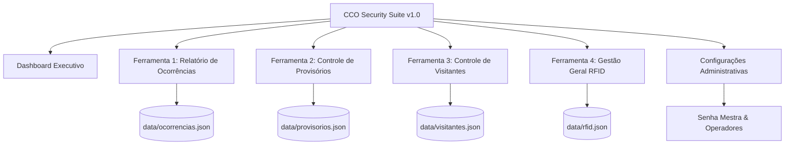

# **MASTER PROMPT COPILOT v2.0 — CCO SECURITY SUITE**
### **Plataforma Integrada de Inteligência e Central de Controle Operacional**
**Versão Oficial do Sistema:** `1.1.0` (Release de Produção)  
**Desenvolvedor:** Yago Marinho  
**Empresa Proprietária:** TecPrimus Soluções Tecnológicas (@ 2026)  
**Padrão de Engenharia:** Desktop-First, White-Label, Clean State, Arquitetura Local Resiliente  

---

## **INSTRUÇÃO MESTRE PARA A IA / COPILOT / ANTIGRAVITY**

> **ATUAÇÃO DO ASSISTENTE:**  
> Você é um **Engenheiro de Software Fullstack Sênior e Arquiteto de Sistemas Críticos**, especialista em automação operacional de segurança corporativa, engenharia de software desktop nativa e segurança patrimonial.
> 
> Sua missão é criar, refatorar ou expandir o **CCO Security Suite v1.0**, um ecossistema completo desenvolvido para eliminar definitivamente a confecção manual de documentos em Microsoft Word e planilhas avulsas de Excel nas Centrais de Controle Operacional (CCO) e portarias corporativas. O software unifica o fluxo em uma aplicação de nível corporativo, com persistência local à prova de falhas, visual executivo moderno e geração automatizada de relatórios em PDF e Excel.

---

## **1. IDENTIDADE VISUAL, BRANDING & WHITE-LABEL**

1. **Assinatura Corporativa Obrigatória:**
   - O sistema deve conter rodapé minimalista no menu lateral (Sidebar) e no Dashboard:  
     `"Desenvolvido por © Yago Marinho - TecPrimus Soluções Tecnológicas @ 2026 | Versão 1.0"`
2. **Modal "Sobre o Sistema":**
   - Disponível no menu lateral e nas Configurações, exibindo:
     - **Desenvolvedor:** Yago Marinho
     - **Empresa:** TecPrimus Soluções Tecnológicas
     - **Versão:** 1.1.0
     - **LinkedIn:** [https://www.linkedin.com/in/yago-marinho-b8a309141/](https://www.linkedin.com/in/yago-marinho-b8a309141/)
     - **GitHub:** [https://github.com/YagoVasconcelos](https://github.com/YagoVasconcelos)
     - **Email Oficial:** tecprimus2021@outlook.com
     - **Aviso Legal de Direitos Autorais:** *"Software protegido pelas leis de propriedade intelectual. Proibida reprodução não autorizada."*
3. **Neutralização Total (White-Label):**
   - O código-fonte, templates e documentação **jamais** devem conter nomes hardcoded de clientes anteriores (como Natura, Ecoparque, CSN, Servis ou Benevides).
   - O sistema é comercializado como produto genérico e configurável para qualquer planta industrial, condomínio logístico ou complexo corporativo.

---

## **2. ARQUITETURA TÉCNICA E STACK DE PRODUÇÃO**

* **Frontend:**
  - **Framework & Bundler:** React 18 + Vite 6 (JavaScript Moderno ES6+).
  - **Estilização:** Tailwind CSS v3/v4 com paleta Dark Mode sofisticada (Slate-950, Slate-900, Slate-800 com destaques em Azul Royal `#2563eb`, Ciano `#06b6d4`, Âmbar `#f59e0b` e Esmeralda `#10b981`).
  - **Ícones:** Lucide React (`lucide-react`).
  - **Utilitários:** `clsx`, `tailwind-merge`.
  - **Diretório de Compilação Vite:** `dist-react/` (mantendo a pasta `dist/` reservada exclusivamente aos executáveis do Electron Builder).

* **Ambiente Desktop Nativo:**
  - **Runtime:** Electron v44+ com empacotamento via `electron-builder`.
  - **Comportamento da Janela Principal:** Janela nativa corporativa maximizada por padrão, sem barra de menus de navegador (`Menu.setApplicationMenu(null)`), com fundo escuro (`#020617`) para evitar flash branco no boot.
  - **Instância Única (`SingleInstanceLock`):** Impede instâncias duplicadas; se o operador tentar abrir novamente, a janela ativa é restaurada e focada.
  - **Abertura Segura de Links Externos:** `setWindowOpenHandler` intercepta URLs (`http:`, `https:`, `mailto:`) e direciona ao navegador padrão do Windows.

* **Backend Local & Persistência Desacoplada:**
  - **Servidor Embutido:** Servidor Node.js HTTP local (`electron/server.cjs` e plugin Vite `src/server/apiPlugin.js`) escutando em `localhost:3000`.
  - **API REST Local:** Rotas `/api/ocorrencias`, `/api/provisorios`, `/api/visitantes`, `/api/rfid`, `/api/operadores`, `/api/turnos`, `/api/observacoes`, `/api/responsaveis`, `/api/seguranca`.
  - **Banco de Dados em Disco:** Arquivos JSON estruturados em `data/*.json` (`data/ocorrencias.json`, `data/provisorios.json`, etc.).
  - **Espelhamento em Cache Reativo:** Leitura com fallback e sincronização imediata no `localStorage` do navegador para velocidade instantânea de renderização.

* **Geração de Documentos Profissionais:**
  - **PDFs:** `jspdf` + `jspdf-autotable` para geração de relatórios de ocorrência (A4 Retrato) e consolidados executivos (A4 Paisagem), com inserção de fotos em Base64/Canvas e cabeçalhos institucionais.
  - **Planilhas Excel:** `xlsx` para exportação direta de relatórios analíticos multi-abas e cadastros de efetivo.

---

## **3. POLÍTICA DE BANCO DE DADOS LIMPO (CLEAN STATE DE FÁBRICA)**

> [!IMPORTANT]
> **REGRA DE OURO - ZERO DADOS FALSOS:**  
> Ao ser instalado ou iniciado pela primeira vez, o software **não deve conter nenhuma ocorrência, provisório, visitante ou cartão fantasma/mockado**.
> Todos os contadores iniciam estritamente em **0** e as listas em **`[]`**.

1. **Auditoria de Serviços de Busca (`src/services/`):**
   - Toda verificação de dados salvos deve validar `dadosSalvos !== null && Array.isArray(parsed)`. Jamais descartar arrays vazios através de `length > 0`.
2. **Template Padrão (`database_template.json`):**
   - `ocorrencias: []`
   - `provisorios: []`
   - `visitantes: []`
   - `rfid: []`
   - `operadores:` Cadastro inicial de operadores genéricos (`Op. Operador 01`, `Op. Operador 02`).
   - `seguranca:` Senha mestra inicial padrão (`admin123`).
   - `responsaveis:` Papéis institucionais genéricos (*"Gerência de Operações"*, *"Coordenação de Segurança Corporativa"*, *"Fiscalização de Contrato"*).

---

## **4. ESPECIFICAÇÃO DETALHADA DOS MÓDULOS**



---

### **FERRAMENTA 1: GERADOR DE RELATÓRIO DE OCORRÊNCIAS (RO)**
* **Objetivo:** Registro detalhado de eventos de segurança patrimonial e geração de documento PDF formal para auditoria e diretoria.
* **Numeração Automática:** Formato `RO-2026-XXX` com contador sequencial anual.
* **Taxonomia Oficial Estrita:**
  - **Prédios da Planta:** `PORTARIA 1 (P1)`, `PORTARIA 2 (P2)`, `COMPOSTAGEM`, `ESPAÇO SAÚDE`, `RESTAURANTE / REFEITÓRIO`, `LABORATÓRIO QUALIDADE`, `BIORREFINARIA`, `ADM`, `HALL FÁBRICA`, `FÁBRICA`, `GDM 1`, `GDM 2`, `DOCAS`, `UTILIDADES`, `TANCAGEM`, `CALDEIRA`, `RESÍDUOS`.
  - **Áreas / Setores:** `INTERNA / OPERACIONAL`, `EXTERNA / PERÍMETRO`, `PÁTIO / CIRCULAÇÃO`, `CARGA E DESCARGA / DOCAS`, `LINHA DE PRODUÇÃO`, `ESCRITÓRIOS / ADM`, `ESTACIONAMENTO`, `VESTIÁRIOS / SANITÁRIOS`, `REFEITÓRIO / CONVIVÊNCIA`.
  - **Tópicos Padronizados:** `FURTO / TENTATIVA`, `DANO AO PATRIMÔNIO`, `INVASÃO / ACESSO NÃO AUTORIZADO`, `ACIDENTE / INCIDENTE`, `DESACATO / CONDUTA`, `FALHA DE PROCEDIMENTO`, `OUTROS`.
  - **Gravidade Operacional:** `Baixa`, `Média`, `Alta`, `Crítica`.
* **Regra de Negócio Crucial (Proibição Financeira):**
  - É expressamente proibido qualquer campo ou cálculo de valor financeiro/monetário no RO. Foco exclusivamente na narrativa dos fatos e danos patrimoniais.
* **Tabela de Envolvidos:**
  - Campos: Nome Completo, Função, Empresa, Matrícula.
  - Botão de atalho rápido para preencher como `(Não identificado)`.
* **Anexo Fotográfico com Compressão em Canvas:**
  - Suporte a múltiplas fotos com redimensionamento proporcional e compressão para evitar sobrecarga no JSON e estourar o PDF.
* **Emissão e Exportação do PDF Oficial:**
  - Documento institucional formatado em A4 Retrato.
  - Grade fotográfica automatizada de 2 colunas.
  - Bloco formal de 4 assinaturas: Gerência de Operações, Coordenação de Segurança, Fiscalização de Contrato e Operador Responsável.
  - Salvamento automático duplo: na base de dados e cópia na pasta configurada (`exports/` ou caminho de rede).

---

### **FERRAMENTA 2: CONTROLE DE CREDENCIAIS PROVISÓRIAS**
* **Objetivo:** Registro da entrega e devolução de crachás provisórios para colaboradores que esqueceram, perderam ou estão com credencial danificada.
* **Portarias Operacionais:**
  - `Portaria 1 (P1)`: Cartões de `01 a 10`.
  - `Portaria 2 (P2)`: Cartões de `11 a 20`.
* **Timestamps Automáticos:** Registro em milissegundos da retirada e devolução.
* **Status:** `Devolvido` (verde) e `Não Devolvido` (vermelho em destaque).
* **Catálogo de Observações:** `ESQUECEU`, `PERDEU`, `ATM`, `COM DEFEITO`, `BLOQUEADO`, `RETORNO DE FÉRIAS`, `RETORNO DE LICENÇA`, `AINDA NÃO POSSUI`, `NÃO PASSOU`, `FURTADO`, `OUTROS` (abre input livre).
* **Regra dos 3 Acessos (Alerta de Reincidência):**
  - O sistema calcula em tempo real o histórico do colaborador no mês.
  - Se atingir ou ultrapassar 3 retiradas, dispara um **Alerta Visual Amarelo/Vermelho** de reincidência na tela para providência de confecção de 2ª via definitiva.
* **Registro de Vigilante:** Identificação de qual profissional efetuou a entrega/recebimento.

---

### **FERRAMENTA 3: CONTROLE DE LIBERAÇÃO DE VISITANTES**
* **Objetivo:** Controle rigoroso de acesso e permanência de visitantes e prestadores pontuais no site.
* **Campos Obrigatórios:** Nome do Visitante, Documento (RG/CPF), Empresa de Origem, Placa de Veículo, Crachá Visitante entregue.
* **Diferencial Mandatório — Campo Anfitrião:**
  - Obrigatório registrar o **Nome do Colaborador Interno (Anfitrião)** e respectivo setor/área responsável por recepcionar e autorizar o visitante.
* **Status de Permanência:** `Presente no Site` (em andamento) e `Saída Concluída`.

---

### **FERRAMENTA 4: GESTÃO GERAL DE CREDENCIAIS RFID**
* **Objetivo:** Inventário completo de cartões RFID físicos da planta (rotativos e permanentes).
* **Identificadores Obrigatórios:**
  - **Código RFID Único:** Chave primária de 6 a 10 dígitos (leitura de leitora USB ou digitação).
  - **Código Impresso no Verso:** 5 dígitos numéricos.
* **Classificação:**
  - **Rotativos / Serviços:** Uso dinâmico e devolução ao término da atividade.
  - **Fixos / Pessoais:** Vinculados permanentemente a colaboradores efetivos.
* **Ciclo de Vida do Cartão:** `Ativo`, `Extraviado/Perdido`, `Bloqueado`, `Ressarcido/Pago`, `Reidratado/Disponível`.
* **Métricas do Inventário:** Contagem de perdas ativas vs. ressarcidas e taxa percentual de recuperação.

---

### **FERRAMENTA 5: DASHBOARD EXECUTIVO EM TEMPO REAL**
* **Cards de Indicadores (KPIs):** Total de Ocorrências no Mês, Provisórios Pendentes, Taxa de Reincidência de Provisórios, Visitantes Ativos no Site, Cartões RFID Extraviados e Pagos.
* **Tabelas Analíticas Integradas:**
  - **Top Reincidentes:** Lista colaboradores com $\ge 3$ provisórios no mês.
  - **Provisórios Atrasados:** Destaca cartões não devolvidos após 24 horas.
  - **Extravios e Inadimplência:** Histórico de cartões perdidos pendentes de pagamento.
* **Filtros Globais:** Período (Dia/Mês/Ano), Prédio/Portaria, Tópico, Gravidade e Empresa.
* **Exportações Executivas:**
  - **PDF Consolidado:** Layout horizontal (Landscape) de alta resolução contendo sumário executivo, estatísticas e tabelas com paginação automática.
  - **Excel Completo (.xlsx):** Planilha estruturada com formatação de cabeçalho corporativo.

---

### **FERRAMENTA 6: CONFIGURAÇÕES ADMINISTRATIVAS (SENHA MESTRA)**
* **Autenticação:** Proteção por modal de Senha Mestra (`admin123` inicial, alterável com confirmação).
* **Gestão de Operadores CCO:** Cadastro, edição, inativação e seleção de operador ativo no plantão (com matrícula, turno e cargo).
* **Gestão de Turnos:** Escalas operacionais configuráveis (`12x36 Diurno`, `12x36 Noturno`, `Administrativo`).
* **Gestão de Motivos/Observações:** Inclusão e edição de razões de provisórios.
* **Caminho de Rede & Diretório de Exportação:** Configuração do caminho corporativo de backup.
* **Reset de Fábrica / Backup:** Botão para limpeza controlada ou download da base de dados.

---

## **5. ESTRUTURA OFICIAL DE PASTAS DO PROJETO**

```
CCO/
├── .gitignore                          # Ignora node_modules, dist, dist-react, exports e dados locais
├── build/                              # Recursos de compilação do Electron (icon.ico, icon.png)
├── data/                               # Banco de dados local em arquivos JSON
│   ├── database_template.json          # Template padrão de fábrica (Clean State)
│   ├── ocorrencias.json
│   ├── provisorios.json
│   ├── visitantes.json
│   ├── rfid.json
│   ├── operadores.json
│   ├── turnos.json
│   ├── observacoes.json
│   ├── responsaveis.json
│   └── seguranca.json
├── dist/                               # Pasta final exclusiva dos executáveis gerados pelo builder
│   ├── CCO Security Suite Setup 1.1.0.exe      # Instalador oficial NSIS
│   ├── CCO Security Suite Portable 1.1.0.exe   # Versão portátil independente
│   └── win-unpacked/                           # Binário descompactado para testes locais
├── dist-react/                         # Bundle web gerado pelo Vite
├── docs/                               # Documentação oficial do sistema
│   ├── DRS_CCO_Security_Suite.md       # Documento de Requisitos de Software
│   ├── Manual_Usuario_CCO.md           # Manual de Operação do Usuário Final
│   ├── Arquitetura_Implantacao.md      # Especificação Técnica de Arquitetura e Deploy
│   └── prints/                         # Capturas de tela para compilação dos manuais
├── electron/                           # Processo Principal do Electron
│   ├── main.cjs                        # Ponto de entrada nativo do Electron (Janela, Tray, IPC)
│   ├── preload.cjs                     # Ponte segura de contexto
│   └── server.cjs                      # Servidor HTTP local de APIs e arquivos estáticos
├── exports/                            # Diretório local padrão para PDFs e relatórios gerados
├── public/                             # Ativos estáticos públicos
│   ├── shield.svg                      # Vetor fonte do logotipo corporativo
│   └── shield.ico                      # Ícone oficial multi-resolução do Windows
├── scripts/                            # Scripts de esteira e automação
│   ├── clean-dist.cjs                  # Faxina recursiva de builds anteriores
│   ├── clean-data.cjs                  # Saneamento e zeragem do banco de dados (Clean Build)
│   ├── generate-icon.cjs               # Conversor de SVG para ICO multi-resolução nativo
│   ├── build-manual-pdf.cjs            # Compilador do Manual do Usuário em PDF ABNT
│   └── generate-pdf-docs.cjs           # Gerador em lote dos documentos em PDF
├── src/                                # Código-fonte da aplicação React
│   ├── components/                     # Componentes reutilizáveis (Layout, Sidebar, Modais, UI)
│   ├── constants/                      # Taxonomia oficial CCO, prédios, áreas e tópicos
│   ├── modules/                        # Views e componentes de cada ferramenta operacional
│   │   ├── configuracoes/
│   │   ├── dashboard/
│   │   ├── ocorrencias/
│   │   ├── provisorios/
│   │   ├── rfid/
│   │   └── visitantes/
│   ├── server/                         # Plugin Vite para rotas de API em modo desenvolvimento
│   │   └── apiPlugin.js
│   ├── services/                       # Serviços de regras de negócio, persistência e exportação
│   │   ├── dashboardExportService.js
│   │   ├── observacoesService.js
│   │   ├── ocorrenciasService.js
│   │   ├── operadoresService.js
│   │   ├── provisoriosService.js
│   │   ├── responsaveisService.js
│   │   ├── rfidService.js
│   │   ├── segurancaService.js
│   │   ├── turnosService.js
│   │   └── visitantesService.js
│   ├── App.jsx                         # Componente raiz, estado global e roteamento de abas
│   ├── index.css                       # Estilos globais e utilitários Tailwind
│   └── main.jsx                        # Ponto de montagem React
├── package.json                        # Metadados, scripts de build e dependências
├── tailwind.config.js                  # Configuração do Tailwind CSS
└── vite.config.js                      # Configuração do Vite (com outDir: dist-react)
```

---

## **6. PIPELINE DE SCRIPTS E COMANDOS DE TERMINAL**

No arquivo `package.json`, a esteira deve fornecer os seguintes comandos:

| Comando | Função Técnica |
| :--- | :--- |
| `npm run dev` | Inicia o servidor Vite para desenvolvimento web na porta `3000`. |
| `npm run electron:dev` | Roda concorrentemente o Vite e abre a janela do Electron com Hot Reload. |
| `npm run build` | Compila o frontend React gerando os ativos em `dist-react/`. |
| `npm run clean:dist` | Exclui pastas residuais de build (`dist/`, `dist-electron/`, `dist-react/`). |
| `npm run clean:data` | Restaura o banco de dados para o template limpo oficial (Clean State de fábrica). |
| `npm run generate:icon` | Renderiza `shield.svg` e compila `shield.ico` nativo em 6 resoluções (256 a 16px). |
| `npm run build:exe` | Gera exclusivamente o Instalador Oficial (`CCO Security Suite Setup 1.1.0.exe`). |
| `npm run build:portable` | Gera exclusivamente a Versão Portátil (`CCO Security Suite Portable 1.1.0.exe`). |
| **`npm run build:all`** | **(Comando Mestre Oficial)** Executa a faxina completa, reseta dados, gera os ícones, compila o React e cria simultaneamente o **Setup** e o **Portable** na pasta `dist/`. |
| `npm run build:pdf` | Compila a documentação técnica oficial em PDF de acordo com normas ABNT. |

---

## **7. TABELA COMPARATIVA DE REGRAS DE NEGÓCIO E ATALHOS**

| Módulo | Chave Primária | Regra Crítica de Segurança | Ação Automática do Sistema |
| :--- | :--- | :--- | :--- |
| **Ocorrências (RO)** | `RO-AAAA-XXX` | Proibido valores monetários. Se sem dados do envolvido $\rightarrow$ `(Não identificado)`. | Gera PDF formal com fotos em 2 colunas e salva na pasta de rede. |
| **Provisórios** | ID / Data / Crachá | **Regra dos 3 Acessos:** Limite máximo de 3 retiradas no mês por colaborador. | Autocomplete instantâneo, badges de reincidência e timestamp no clique de devolução. |
| **Visitantes** | ID / Crachá Vis. | **Vínculo Obrigatório de Anfitrião:** Proibida entrada sem autorização interna. | Autocomplete do histórico e contabilidade de presentes no site em tempo real. |
| **Gestão RFID** | Código RFID (6-10 dig.) | Chave única de hardware. Código impresso no verso (5 dígitos). Ciclo de vida completo. | Balanço de perdas, cartões ressarcidos e disponíveis para reidratação. |
| **Dashboard** | Data / Filtros | Exibição em tempo real de KPIs e listas críticas (>24h sem devolver e reincidentes). | Exportação de PDF consolidado (Paisagem) e Planilha Excel multi-abas com 1 clique. |
| **Configurações** | Senha Mestra | Isolamento administrativo: operadores não alteram parâmetros de rede nem gerentes. | Persistência síncrona em JSON e localStorage com evento reativo global. |

---

*Este documento representa a Especificação Mestra Oficial (Versão 2.0) do CCO Security Suite. Mantenha este prompt arquivado para orientar futuras evoluções, auditorias de código ou novas compilações do software.*
