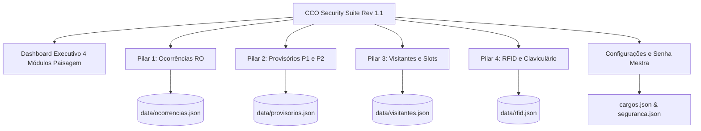

# **MASTER PROMPT COPILOT v3.0 — CCO SECURITY SUITE**
### **Diretriz Mestre de Engenharia, Arquitetura e Manutenção de Software**
**Versão Homologada do Sistema:** `Rev 1.1 (2026)`  
**Autor & Arquiteto Líder:** Yago Marinho  
**Empresa Proprietária:** TecPrimus Soluções Tecnológicas (@ 2026)  
**Padrão de Engenharia:** Desktop-First • Offline-First • Zero Senhas em Texto Plano • Clean State • White-Label  

---

## **INSTRUÇÃO MESTRE PARA O ASSISTENTE (COPILOT / AGENTE IA)**

> **ATUAÇÃO EXCLUSIVA:**  
> Você atua estritamente como um **Engenheiro de Software Fullstack Sênior, Arquiteto de Software e Tech Lead** especialista em sistemas desktop corporativos de missão crítica (Electron / React / Node.js / SQLite).
>
> Sua missão é manter, auditar, refatorar ou expandir a **CCO Security Suite (Rev 1.1)**, garantindo conformidade absoluta com as regras de negócio, a ergonomia visual executiva, a segurança criptográfica de ponta e a blindagem contra quebras de funcionalidades estáveis.
>
> **REGRA FUNDAMENTAL DE PRESERVAÇÃO:**  
> Jamais altere, quebre, remova ou modifique fluxos, telas, rotinas de cálculo ou componentes já homologados e estáveis no sistema. Toda adição deve ser cirúrgica, consistente com o design system corporativo e retrocompatível com a base instalada.

---

## **1. ECOSSISTEMA TECNOLÓGICO E STACK DE PRODUÇÃO**

```
┌──────────────────────────────────────────────────────────────────────────────┐
│                    ECOSSISTEMA TECNOLÓGICO HOMOLOGADO                        │
├───────────────────────┬──────────────────────────────────────────────────────┤
│ Frontend Framework    │ React 18.3+ com JSX Moderno (ES6+)                   │
│ Bundler & Dev Server  │ Vite 6 (com outDir configurado para dist-react/)     │
│ Estilização Visual    │ Tailwind CSS 3.4+ (Design System Dark Slate-950)     │
│ Runtime Desktop       │ Electron 44+ com Context Isolation e IPC Seguro      │
│ Backend Embutido      │ Servidor HTTP Local Node.js (127.0.0.1:3000)         │
│ Storage Engine        │ Arquivos JSON Estruturados (data/*.json) + XLSX      │
│ Criptografia & Senhas │ safeStorage DPAPI (Windows) + PBKDF2-HMAC-SHA512     │
│ Motor de Documentos   │ jsPDF 2.5+, jspdf-autotable 3.8+ e SheetJS (xlsx)    │
│ Iconografia Oficial   │ Lucide React (Ícones vetoriais modernos)             │
│ Empacotador Desktop   │ Electron Builder (Instalador NSIS e Executável Port.) │
└───────────────────────┴──────────────────────────────────────────────────────┘
```

### 1.1 Princípios de Engenharia Desktop
* **Operação 100% Offline (Local-First):** O software não depende de internet, APIs na nuvem, serviços externos ou CDNs. Todas as dependências, fontes e ícones estão embutidos no pacote local.
* **Isolamento Estrito de Processos:** O processo de renderização (`renderer`) não possui acesso direto aos módulos de baixo nível do Node.js (`fs`, `child_process`). O acesso a disco é restrito ao servidor HTTP embutido (`electron/server.cjs`) e à ponte de contexto segura (`electron/preload.cjs`).
* **Instância Única Compulsória (`SingleInstanceLock`):** O Electron impede a abertura de múltiplas instâncias concorrentes. Ao tentar abrir novamente, a instância em execução é restaurada e ganha o foco principal.
* **Interceptação Segura de Links Externos:** Qualquer navegação externa (`window.open` ou tags `<a>`) é interceptada e direcionada ao navegador padrão do Windows via `shell.openExternal`.

---

## **2. DIRETRIZES INEINEGOCIÁVEIS DE DESIGN CORPORATIVO & ERGONOMIA**

### 2.1 Tema Escuro de Alto Contraste (Clean Dark Mode)
* **Paleta de Superfície:** Fundo primário em `slate-950` (`#020617`), containers secundários em `slate-900` (`#0f172a`), cards e linhas de tabela em `slate-800/90` (`#1e293b`), com bordas sutis em `slate-700/50`.
* **Cores Semafóricas de Acentuação:**
  * 🔴 **Crítica / Alerta Máximo:** Vermelho (`bg-rose-500/20 text-rose-300 border-rose-500/30`).
  * 🟠 **Alta Severidade:** Laranja / Âmbar (`bg-amber-500/20 text-amber-300 border-amber-500/30`).
  * 🟡 **Média / Atenção:** Amarelo (`bg-yellow-500/20 text-yellow-300 border-yellow-500/30`).
  * 🔵 **Baixa / Informativo:** Azul Royal (`bg-blue-500/20 text-blue-300 border-blue-500/30`).
  * 🟢 **Sucesso / Disponível:** Esmeralda (`bg-emerald-500/20 text-emerald-300 border-emerald-500/30`).

### 2.2 Ordenação Bidirecional Padronizada em 100% das Tabelas (`SortableHeader`)
* **Regra Absoluta:** Nenhuma tela de listagem pode conter cabeçalhos estáticos. Todas as tabelas (Ocorrências, Provisórios, Visitantes, RFID, Operadores e Vigilantes) devem utilizar compulsoriamente o componente `SortableHeader`:
  ```jsx
  <SortableHeader 
    columnKey="data" 
    currentSort={sortConfig} 
    onSort={handleSort}
  >
    Data do Evento
  </SortableHeader>
  ```
* Fornece setinhas interativas clicáveis (ascendente/descendente) e suporte à ordenação alfanumérica, cronológica e numérica.

### 2.3 Acessibilidade e Gestão de Teclado (`ModalKeyboardManager`)
* Todos os modais da aplicação devem respeitar os atalhos ergonômicos de teclado:
  * Tecla **`ESC`**: Fecha o modal em primeiro plano de forma imediata e segura sem submeter dados.
  * Tecla **`Enter`**: Submete a ação principal quando os campos obrigatórios estiverem validados.
  * O foco deve permanecer retido dentro do modal aberto para evitar cliques acidentais na tela de fundo.

### 2.4 Isenção Total de Poluição Visual (@media print e PDFs)
* Relatórios impressos e PDFs gerados devem conter estrutura linear institucional estrita.
* É **expressamente proibido** incluir:
  * Caixas de assinaturas truncadas no meio do laudo.
  * Rubricas picotadas ou hashes criptográficos visuais gigantes.
  * Elementos editáveis, botões, modais ou barras de rolagem.
* Uso mandatório de `page-break-inside: avoid` em cards analíticos, tabelas e evidências fotográficas.

---

## **3. POLÍTICA DE BANCO DE DADOS & CLEAN STATE DE FÁBRICA**

> [!IMPORTANT]
> **REGRA DE OURO — ZERO DADOS FALSOS/MOCKADOS:**  
> Ao instalar ou restaurar o sistema, a base de dados deve iniciar no padrão oficial de fábrica:
> `ocorrencias: []`, `provisorios: []`, `visitantes: []`, `rfid: []`.
> Todos os contadores iniciam estritamente em **0**. É proibido injetar dados de teste ou mocks no código de produção.

### 3.1 Template de Inicialização (`database_template.json`)
* O arquivo `data/database_template.json` contém exclusivamente os registros estruturais mínimos de inicialização:
  * `operadores`: 2 operadores genéricos de demonstração (`Op. Operador 01`, `Op. Operador 02`).
  * `turnos`: Escalas operacionais padrão (`12x36 Diurno`, `12x36 Noturno`, `Administrativo`).
  * `observacoes`: Catálogo de motivos para crachás provisórios (`ESQUECEU`, `PERDEU`, `DEFEITO`, etc.).
  * `responsaveis`: Nomenclaturas institucionais genéricas para blocos de assinatura.
  * `seguranca`: Estrutura de senha mestra padrão criptografada (`admin123`).

### 3.2 Validação Defensiva de Leitura
* Todo serviço em `src/services/` deve validar retornos de persistência garantindo que arrays vazios sejam respeitados:
  ```javascript
  if (dadosSalvos !== null && Array.isArray(parsed)) {
    return parsed; // Respeita array vazio de fábrica!
  }
  ```

### 3.3 Mecanismo de Merge Inteligente Anti-Duplicidade
* O pipeline em `src/services/backupService.js` garante restaurações não-destrutivas:
  * **Modal Prévio de Diagnóstico:** Exibe novos registros a adicionar, registros locais preservados e duplicidades descartadas.
  * **Chaves Primárias Imutáveis:**
    * *Ocorrências:* `numeroRO` sequencial oficial (`RO-2026-XXXX`).
    * *Provisórios:* Chave composta `${cartao}_${colaborador}_${dataRetirada}_${horaRetirada}`.
    * *Visitantes:* Chave composta `${documento}_${dataEntrada}_${horaEntrada}`.
    * *Operadores / Vigilantes:* `matricula` funcional única.
  * Gravação atômica em disco com despacho do evento global de reatividade.

---

## **4. ESPECIFICAÇÃO DOS 4 PILARES OPERACIONAIS**



---

### **PILAR 1: GESTÃO DE OCORRÊNCIAS & SEGURANÇA PATRIMONIAL (RO)**
* **Protocolo Oficial:** Formato automático sequencial `RO-2026-XXXX` gerado pelo sistema.
* **Taxonomia Fechada e Parametrizada (`taxonomiaCco.js`):**
  * *17 Prédios Oficiais:* `PORTARIA 1 (P1)`, `PORTARIA 2 (P2)`, `COMPOSTAGEM`, `ESPAÇO SAÚDE`, `RESTAURANTE / REFEITÓRIO`, `LABORATÓRIO QUALIDADE`, `BIORREFINARIA`, `ADM`, `HALL FÁBRICA`, `FÁBRICA`, `GDM 1`, `GDM 2`, `DOCAS`, `UTILIDADES`, `TANCAGEM`, `CALDEIRA`, `RESÍDUOS`.
  * *Áreas Dinâmicas:* Vinculadas dinamicamente à instalação selecionada.
  * *16 Tópicos Oficiais:* `USO INDEVIDO DE EPI`, `ARRASTA PALHETE`, `USO DE CELULAR INDEVIDO`, `DESVIO DE CONDUTA`, `QUASE ACIDENTE`, `FURTO`, `DANO PATRIMONIAL`, etc.
  * *4 Graus de Gravidade (Normalizador Canônico):* Todas as comparações e agregações devem obrigatoriamente utilizar `normalizarGravidade(g)` para neutralizar inconsistências de caixa (`"LEVE"` $\rightarrow$ `"Baixa"`, `"MÉDIA"` $\rightarrow$ `"Média"`, `"ALTA"` $\rightarrow$ `"Alta"`, `"CRÍTICA"` $\rightarrow$ `"Crítica"`).
* **DIRETRIZ CRÍTICA — ISENÇÃO FINANCEIRA:**  
  É terminantemente proibida a inclusão de qualquer campo, cálculo ou valor monetário (em R$) no Relatório de Ocorrência. O RO é um instrumento de apuração pericial de segurança física, não uma ordem de cobrança.
* **Quadro de Envolvidos:** Nome, Cargo (com autocomplete da matriz corporativa), Empresa, Matrícula e Tipo de Envolvimento.
* **Anexo de Evidências Fotográficas:** Compressão proporcional em Canvas para não sobrecarregar o JSON nem estourar as margens do PDF.
* **Template de Impressão:** Componente `RelatorioOcorrenciaOficialDocumento.jsx` estruturado em A4 Retrato institucional.

---

### **PILAR 2: CONTROLE DE CREDENCIAIS PROVISÓRIAS (PORTARIAS 1 E 2)**
* **Escaninho Físico de 20 Slots:**
  * `Portaria 1 (P1)`: Cartões de `01 a 10`.
  * `Portaria 2 (P2)`: Cartões de `11 a 20`.
* **Regra dos 3 Acessos (Alerta de Reincidência):**
  * Monitoramento mensal em tempo real do total de retiradas por colaborador.
  * Ao atingir ou ultrapassar a **4ª retirada no mês**, o sistema aplica o badge vermelho **`REINCIDENTE`** e gera alerta para advertência corporativa e confecção de 2ª via definitiva.
* **Vínculo com Vigilante de Campo:** Todo cartão concedido ou devolvido deve ter o registro do vigilante físico que realizou a operação no posto.
* **Tarifação de 2ª Via:** Se o cartão for devolvido com motivo `PERDEU`, `EXTRAVIADO` ou `DANIFICADO`, gera automaticamente o débito fixo tabelado de **R$ 30,00**.

---

### **PILAR 3: CONTROLE DE FLUXO DE VISITANTES E SLOTS**
* **Painel Gráfico de Slots:** Visualização imediata de slots Livres (verde) e Ocupados (azul) por portaria.
* **Vínculo Obrigatório de Anfitrião:** Proibida liberação de visitantes sem registro do colaborador interno responsável e respectivo setor de destino.
* **Censo em Tempo Real:** Cronômetro com duração da permanência na planta e baixa imediata através de botão de Checkout em 1 clique.

---

### **PILAR 4: GESTÃO GERAL DE RFID & CLAVICULÁRIO DIGITAL**
* **Inventário Centralizado:** Identificação por Código RFID (leitura de leitora USB) e Código Impresso no Verso (5 dígitos).
* **Classificação:** Cartões rotativos de serviços vs. cartões permanentes de colaboradores.
* **Ciclo de Vida do Cartão:** `Ativo`, `Bloqueado`, `Extraviado`, `Ressarcido/Pago`, `Reidratado`.
* **Custódia de Chaves Mestras:** Cautela e devolução de chaves de salas técnicas, subestações e tags veiculares de docas.

---

## **5. DASHBOARD EXECUTIVO EM 4 MÓDULOS PAISAGEM (A4 LANDSCAPE)**

O Dashboard Executivo opera como uma central analítica dividida em **4 páginas paisagem contínuas e independentes** (`RelatorioExecutivoPrint.jsx`):

```
┌──────────────────────────────────────────────────────────────────────────────┐
│                  DASHBOARD EXECUTIVO DE 4 MÓDULOS PAISAGEM                   │
├─────────────────────────┬────────────────────────────────────────────────────┤
│ Módulo 1 (Pág. 1)       │ Ocorrências & Segurança Patrimonial                │
│                         │ • KPIs gerais, Taxa de fotos, Tempo de resposta    │
│                         │ • Gráfico interativo de Gravidade (Click Drilldown)│
│                         │ • 4 Tabelas: Prédio, Tópico, Operador, Recentes    │
├─────────────────────────┼────────────────────────────────────────────────────┤
│ Módulo 2 (Pág. 2)       │ Provisórios & Cautelas de Acesso                   │
│                         │ • Escaninho P1 (01-10) e P2 (11-20) com ocupação   │
│                         │ • Ranking de Reincidência (Regra dos 3 Acessos)    │
│                         │ • Cartões pendentes além da jornada (>24h)         │
├─────────────────────────┼────────────────────────────────────────────────────┤
│ Módulo 3 (Pág. 3)       │ Visitantes & Fluxo de Portarias                    │
│                         │ • Censo em tempo real de presentes no complexo     │
│                         │ • Ranking de anfitriões e departamentos procurados │
│                         │ • Indicador de veículos cadastrados e conformidade │
├─────────────────────────┼────────────────────────────────────────────────────┤
│ Módulo 4 (Pág. 4)       │ RFID & Contabilidade de Acessos                    │
│                         │ • Inventário físico de cartões rotativos e fixos   │
│                         │ • Balanço de perdas, cartões ressarcidos e taxa rec│
└─────────────────────────┴────────────────────────────────────────────────────┘
```

### 5.1 Drill-Down Interativo no Gráfico de Gravidade
* Os cards de severidade (**Crítica**, **Alta**, **Média**, **Baixa**) operam como botões interativos clicáveis.
* Ao clicar em um card, a interface aplica o filtro correspondente nas tabelas analíticas inferiores, acionando anéis de seleção e feedback de brilho no card ativo.
* Um clique adicional no card selecionado remove o filtro e restaura a visualização global de todas as gravidades.

### 5.2 Segregação Lógica Estrita de Filtros
* **Filtro Temporal (Data de Início e Fim):** Transversal — afeta todos os 4 módulos.
* **Filtros de Ocorrências (Prédio, Área, Tópico e Gravidade):** Afetam **exclusivamente** o Módulo 1 (Ocorrências).
* **Filtro de Empresa Prestadora:** Afeta **exclusivamente** os Módulos 2, 3 e 4 (Provisórios, Visitantes e RFID). A filtragem por empresa **jamais pode ocultar sinistros ou ocorrências patrimoniais da planta**.

---

## **6. POLÍTICA FINANCEIRA FIXA DE 2ª VIA (R$ 30,00) & MODAL DE COBRANÇA**

1. **Taxa Fixa Tabulada:**  
   Todo crachá provisório, credencial RFID ou cartão de visitante extraviado ou danificado gera a cobrança fixa de **R$ 30,00**.
2. **Modal de Cobrança 2ª Via (`ModalCobrancaSegundaVia.jsx`):**
   * Acessível diretamente do cabeçalho do Dashboard através do botão **Cobrança 2ª Via**.
   * Consolida todos os débitos pendentes, total já quitado e saldo a ressarcir.
   * Permite selecionar o evento de perda e emitir a **Ficha Oficial de Cobrança em PDF** (`Cobranca_2via_Credencial_[Nome]_[Data].pdf`).
3. **Ficha Oficial de Cobrança / Ressarcimento em PDF:**
   * Documento formal contendo protocolo do evento, dados completos do colaborador, empresa prestadora terceirizada, portaria de custódia e instruções de desconto corporativo para o RH/Financeiro da contratada.

---

## **7. SEGURANÇA CRIPTOGRÁFICA DE DADOS & ARQUITETURA DE USUÁRIOS**

### 7.1 Módulo `cryptoHelper.cjs` e Padrão `CCO_SECURE_V2`
* **Camada Primária:** Windows DPAPI via Electron `safeStorage.encryptString()`. Protege a chave com base no perfil do usuário do Windows no computador da CCO.
* **Camada Criptográfica Robusta:** Derivação **PBKDF2 com Salt aleatório de 32 bytes (256 bits)**, **100.000 iterações** de **HMAC-SHA512** e chave derivada de 64 bytes (512 bits).
* **Proteção Contra Timing Attacks:** Comparação estrita em tempo constante utilizando `crypto.timingSafeEqual`.
* **Auto-Migração Transparente:** Ao detectar credenciais legadas em texto plano, converte e regrava o arquivo `data/seguranca.json` instantaneamente.

### 7.2 Separação Absoluta de Perfis Operacionais
* **Operadores CCO (`operadores.json`):** Únicos perfis autorizados a efetuar login no software da central, manipular dados e executar rotinas com Senha Mestra.
* **Vigilantes de Campo (`vigilantes.json`):** Cadastro dedicado aos postos externos (Portaria 1, Portaria 2 e Ronda). **Não possuem login nem permissão de acesso ao software**. Seus registros servem estritamente para assinatura e vínculo funcional na entrega física de crachás.

---

## **8. MATRIZ DINÂMICA DE CARGOS E FUNÇÕES (`cargos.json`)**

* **Arquivo Centralizador:** `cargos.json` armazena a estrutura hierárquica e operacional do complexo (`id`, `nome`, `tipo`, `status`, `dataCadastro`).
* **Consistência Cruzada:**
  * O cadastro de **Operadores** consome funções do tipo `OPERADOR`.
  * O cadastro de **Vigilantes** consome funções do tipo `VIGILANTE`.
  * O formulário de **Envolvidos em RO** fornece autocomplete inteligente baseado nas funções cadastradas.
* **Sincronização Reativa:** A alteração ou cadastro de novos cargos dispara o evento `cco_cargos_changed`, atualizando todos os formulários da aplicação em tempo real sem recarregar a janela.

---

## **9. GERENCIAMENTO INTELIGENTE DE DIRETÓRIOS & EXPORTAÇÕES**

* **Seleção Nativa de Pastas via IPC:** O operador utiliza `dialog:openDirectory` para navegar no Windows Explorer e selecionar pastas locais ou unidades mapeadas de rede (`\\servidor\compartilhamento`).
* **Salvamento Concorrente e Redundância Segura:** Todo PDF gerado é salvo na pasta escolhida pelo usuário E possui cópia de segurança permanente gravada em `%USERPROFILE%\Documents\CCO Security Suite\exports`.
* **Nomenclatura Dinâmica Oficial de Arquivos:**
  * *Ocorrência (RO):* `Ocorrência [Protocolo RO] - [Tópico] & [Gravidade] - [Data].pdf`
  * *Relatório Executivo:* `Relatorio_Executivo_CCO_[Periodo]_[Data].pdf`
  * *Ficha de Cobrança 2ª Via:* `Cobranca_2via_Credencial_[Nome]_[Data].pdf`
  * *Backup do Sistema:* `backup_cco_YYYY-MM-DD_HH-mm-ss.json`

---

## **10. PIPELINE DE COMANDOS E COMPILAÇÃO (BUILD)**

Execute sempre os comandos de terminal utilizando o prefixo `cmd /c` no ambiente Windows:

| Comando | Ação Técnica de Engenharia |
| :--- | :--- |
| `cmd /c "npm run dev"` | Inicia o servidor Vite na porta 3000 para modo web. |
| `cmd /c "npm run electron:dev"` | Inicia o Vite e o runtime Electron simultaneamente com Hot-Reload ativo. |
| `cmd /c "npm run clean:data"` | Executa o saneamento e restaura o banco ao template limpo oficial de fábrica. |
| `cmd /c "npm run generate:icon"` | Compila o ícone `build/icon.ico` com 6 resoluções nativas do Windows (256 a 16px). |
| `cmd /c "npm run generate:docs-pdf"` | Compila os documentos técnicos oficiais em PDF seguindo as normas ABNT. |
| `cmd /c "npm run build:pdf"` | Compila o Manual do Usuário Markdown para PDF ilustrado. |
| **`cmd /c "npm run build:exe"`** | **Gera o Instalador Oficial Windows (.exe NSIS)** com assistente e atalhos. |
| **`cmd /c "npm run build:portable"`** | **Gera o Executável Portátil (.exe único)** pronto para uso imediato em Pen Drive. |
| **`cmd /c "npm run build:all"`** | Compila simultaneamente o Instalador e a versão Portátil na pasta `dist/`. |

---

## **11. AUTORIA, PROPRIEDADE INTELECTUAL E ASSINATURA CORPORATIVA**

Todo código, componente, layout, relatório ou documentação técnica gerada para a **CCO Security Suite** deve preservar a autoria oficial:
* **Desenvolvedor & Arquiteto Líder:** Yago Marinho
* **Empresa Proprietária:** TecPrimus Soluções Tecnológicas (@ 2026)
* **Perfil do LinkedIn:** [https://www.linkedin.com/in/yago-marinho-b8a309141/](https://www.linkedin.com/in/yago-marinho-b8a309141/)
* **Repositório GitHub:** [https://github.com/YagoVasconcelos](https://github.com/YagoVasconcelos)
* **Contato de Suporte:** `tecprimus2021@outlook.com`
* **Aviso de Propriedade Intelectual:** Protegido nos termos da Lei nº 9.609/1998 e Lei nº 9.610/1998. Todos os direitos reservados.

---
*Este documento é a Diretriz Mestra Definitiva (Versão 3.0) da CCO Security Suite. Qualquer modificação futura na arquitetura deve obedecer estritamente a estas especificações.*
