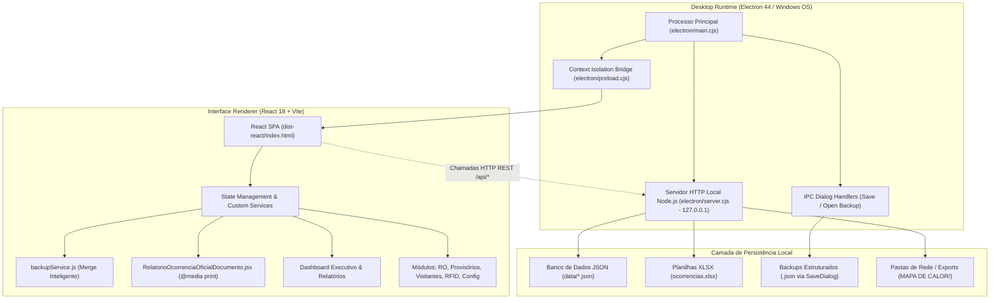

# CCO Security Suite Rev 1.0 | TecPrimus Soluções Tecnológicas
**Desenvolvedor:** Yago Marinho | **Empresa:** TecPrimus Soluções Tecnológicas | **Versão:** Rev 1.0 (2026)  
**Contato:** [LinkedIn](https://www.linkedin.com/in/yago-marinho-b8a309141/) | [GitHub](https://github.com/YagoVasconcelos) | **E-mail:** tecprimus2021@outlook.com

---

# Arquitetura de Software e Guia de Implantação (TI & Engenharia) — Rev 1.0

## 1. Visão Geral da Arquitetura

O **CCO Security Suite (Rev 1.0)** adota uma arquitetura híbrida de alta performance que combina a reatividade de uma Single Page Application (**React 18 + Tailwind CSS**) com o poder e integração com o sistema operacional providos pelo ecossistema **Electron 44** e **Node.js**.

### 1.1 Diagrama de Arquitetura de Alto Nível



### 1.2 Princípios Arquiteturais
1. **Isolamento de Processos e Segurança:** O processo de renderização não possui acesso irrestrito ao `node:fs` ou `node:child_process`. As chamadas de I/O em disco são mediadas via HTTP interno restrito (`127.0.0.1`) pelo servidor local embutido (`electron/server.cjs`) e via IPC com canal seguro no `preload.cjs`.
2. **Resiliência Offline Total:** Nenhuma dependência de CDNs externas, endpoints na nuvem ou serviços de autenticação remota. Fontes, bibliotecas e estilos estão empacotados localmente no bundle de produção.
3. **Persistência Baseada em Arquivos (File-Based Storage):** Os dados são mantidos em arquivos JSON estruturados, legíveis por humanos e fáceis de auditar e realizar backup, eliminando a necessidade de gerenciar serviços de bancos de dados relacionais pesados em computadores de portaria.
4. **Arquitetura de Usuários e Separação de Papéis:**
   * **Operadores do Sistema (`operadores.json`):** Contas com permissão de login no software CCO, manipulação de relatórios, parâmetros e execução de rotinas administrativas.
   * **Efetivo de Vigilância de Campo (`vigilantes.json`):** Registros dedicados aos vigilantes físicos (Portarias 1 e 2, Ronda), utilizados estritamente para vínculo de responsabilidade na concessão e baixa de cartões provisórios, sem acesso às telas do software.

---

## 2. Estrutura Completa de Diretórios do Projeto

```
CCO/
├── .gitignore                      # Regras rigorosas de sigilo (ignora dados reais de clientes)
├── README.md                       # Documentação executiva na raiz (Rev 1.0)
├── package.json                    # Metadados do software, dependências e scripts de build
├── vite.config.js                  # Configuração do Vite com base relativa (./)
├── tailwind.config.js              # Tokens de design e cores corporativas
├── index.html                      # Ponto de montagem da SPA React
│
├── build/                          # Recursos de compilação do Electron Builder
│   ├── icon.ico                    # Ícone multi-resolução para Windows (256 a 16 px)
│   └── icon.png                    # Ícone PNG máster de 256x256
│
├── public/                         # Assets públicos estáticos
│   ├── shield.svg                  # Vetor original do brasão/escudo
│   ├── icon.ico                    # Ícone para web e atalhos
│   └── icon-256.png                # Imagem de alta resolução
│
├── electron/                       # Código-fonte do Runtime Desktop
│   ├── main.cjs                    # Processo principal (janela, menus nativos, handlers IPC de backup)
│   ├── preload.cjs                 # Ponte segura de contexto (Context Isolation)
│   └── server.cjs                  # Servidor local Node.js (API REST, merge e persistência)
│
├── data/                           # Armazenamento oficial de dados (JSON)
│   ├── database_template.json      # Template de fábrica limpo e homologado
│   ├── ocorrencias.json            # Base de dados de Relatórios de Ocorrências
│   ├── provisorios.json            # Base de dados de Credenciais Provisórias
│   ├── visitantes.json             # Base de dados de Visitantes
│   ├── rfid.json                   # Base de dados de Chaves e RFID
│   ├── operadores.json             # Lista de Operadores CCO (Central com Login)
│   ├── vigilantes.json             # Efetivo de Vigilância de Campo (Portarias/Ronda)
│   ├── turnos.json                 # Lista de Turnos da Escala
│   ├── observacoes.json            # Lista de Motivos de Provisórios
│   ├── responsaveis.json           # Responsáveis da Planta e Assinaturas
│   └── seguranca.json              # Senha Mestra do Sistema
│
├── templates/                      # Espelho dos modelos de dados para deploy limpo
│   └── database_template.json      # Modelo padrão de inicialização
│
├── scripts/                        # Scripts utilitários de automação
│   ├── clean-data.cjs              # Higienização de dados antes do build (Clean Build)
│   ├── generate-icon.cjs           # Gerador automatizado do ícone .ico via Electron
│   ├── generate-pdf-docs.cjs       # Compilador oficial dos PDFs ABNT (Rev 1.0)
│   └── build-manual-pdf.cjs        # Compilador do Manual do Usuário Markdown para PDF
│
├── docs/                           # Documentação Técnica e de Usuário (Rev 1.0)
│   ├── DRS_CCO_Security_Suite.md   # Documento de Requisitos de Software
│   ├── Manual_Usuario_CCO.md       # Manual de Operação do Usuário
│   └── Arquitetura_Implantacao.md  # Este Guia Técnico de TI e Implantação
│
├── src/                            # Código-fonte da aplicação React
│   ├── main.jsx                    # Ponto de entrada do React DOM
│   ├── App.jsx                     # Roteador principal e gerenciamento de telas
│   ├── index.css                   # Estilos globais e regras de impressão (@media print)
│   │
│   ├── components/                 # Componentes compartilhados
│   │   ├── layout/                 # Layouts (Sidebar, Header corporativo)
│   │   └── common/                 # Modais genéricos (ModalSobre, ModalSenha, etc.)
│   │
│   ├── constants/                  # Matriz oficial de taxonomia corporativa
│   │   └── taxonomiaCco.js         # Prédios, Áreas, Tópicos e Empresas
│   │
│   ├── modules/                    # Módulos de negócio da CCO
│   │   ├── dashboard/              # Dashboard Executivo e Detalhamento Analítico
│   │   ├── ocorrencias/            # Ferramenta 1: Relatório de Ocorrências (RO)
│   │   │   ├── RelatorioOcorrenciaForm.jsx            # Formulário de Cadastro e Edição
│   │   │   └── RelatorioOcorrenciaOficialDocumento.jsx # Template Linear Estrito Oficial
│   │   ├── provisorios/            # Ferramenta 2: Credenciais Provisórias P1 e P2
│   │   ├── visitantes/             # Ferramenta 3: Controle de Visitantes e Slots
│   │   ├── rfid/                   # Ferramenta 4: Gestão de RFID e Chaves
│   │   └── configuracoes/          # Painel de Configurações Administrativas
│   │       └── PainelBackupRestauracao.jsx # Painel de Backup & Merge Inteligente
│   │
│   ├── services/                   # Camada de serviços e regras de negócio
│   │   ├── backupService.js        # Lógica de Exportação e Merge Anti-Duplicidade
│   │   ├── ocorrenciasService.js   # Persistência e regras de negócio de RO
│   │   ├── provisoriosService.js   # Regras de limite de 3 acessos e reincidência
│   │   ├── visitantesService.js    # Gerenciamento de slots e checkout de visitantes
│   │   ├── rfidService.js          # Gestão de custódia de chaves
│   │   └── dashboardExportService.js # Compilação de relatórios PDF e bases XLSX
│   │
│   └── server/                     # Middleware de desenvolvimento para o Vite
│       └── apiPlugin.js            # Endpoints da API REST local (backup, persistência)
│
└── dist-electron/                  # Artefatos compilados de produção
    ├── CCO Security Suite Setup 1.0.0.exe      # Instalador oficial Windows (NSIS)
    ├── CCO Security Suite Portable 1.0.0.exe   # Executável portátil autônomo
    └── win-unpacked/                           # Pasta de binários descompactada
```

---

## 3. Modelo de Persistência e Storage Engine

### 3.1 Camada de Dados em Arquivos JSON
Cada entidade do sistema é armazenada em seu respectivo arquivo JSON estruturado em `data/`:
* `ocorrencias.json`: Array de objetos contendo `numeroRO`, `data`, `hora`, `local`, `topico`, `gravidade`, `envolvidos`, `fotosBase64`, `nomeArquivoPdf`.
* `provisorios.json`: Array de movimentações de credenciais com `nome`, `empresa`, `cartao`, `portaria`, `vigilante`, `dataRetirada`, `horaRetirada`, `dataDevolucao`, `horaDevolucao`, `motivo`.
* `visitantes.json`: Array de visitas com `nome`, `documento`, `empresa`, `contato`, `portaria`, `crachá`, `dataEntrada`, `horaEntrada`, `status`.
* `operadores.json`: Membros da equipe da Central CCO autorizados a operar o software.
* `vigilantes.json`: Efetivo operacional de campo (Portaria 1, Portaria 2 e Ronda) para vínculo nas credenciais.
* `responsaveis.json`: Parâmetros de assinaturas corporativas (Gerência, Coordenação, Fiscal) e diretório de rede configurado (`caminhoRede`).
* `turnos.json`: Escalas operacionais cadastradas (ex: 12x36 Diurno, 12x36 Noturno, Administrativo).
* `observacoes.json`: Motivos parametrizados para credenciais temporárias (Esqueceu, Perdeu, Defeito, etc.).
* `seguranca.json`: Objeto contendo `{ senhaMestra: "...", dataAtualizacao: "..." }`.

---

### 3.2 Estratégia de Resolução de Diretórios & Salvamento Concorrente (Safe Storage)

Para garantir que nenhum relatório em PDF ou planilha Excel seja perdido por falhas de conectividade de rede ou restrições de permissão do Windows:
1. **Hierarquia de Resolução (`getSafeExportDirectory`):**
   * Se o usuário configurou um caminho personalizado em **Configurações** (`caminhoRede`), o sistema valida permissão de escrita criando e removendo um arquivo temporário de teste.
   * Se o caminho for UNC (`\\servidor\compartilhamento`) ou absoluto (`C:\...`), ele é utilizado como destino adicional.
   * Se for relativo (`MAPA DE CALOR/2026/09.SETEMBRO`), ele é resolvido dentro de `Documentos\CCO Security Suite\`.
2. **Diretório Primário Inviolável:**
   * Independentemente do caminho de rede, o sistema sempre grava uma cópia no diretório padrão do usuário do Windows: `%USERPROFILE%\Documents\CCO Security Suite\exports`.
3. **Endpoints Dedicados no Servidor Embutido:**
   * `GET /api/diretorio-padrao`: Retorna os caminhos seguros do sistema operacional.
   * `POST /api/validar-diretorio`: Testa em tempo de execução a acessibilidade e permissão de escrita de qualquer caminho submetido pelo usuário.
   * `GET /api/responsaveis` e `POST /api/salvar-responsaveis`: Persiste instantaneamente os responsáveis e o caminho de rede no arquivo `data/responsaveis.json`.

---

### 3.3 Módulo de Backup & Restauração (Merge Inteligente Anti-Duplicidade)

O sistema conta com um pipeline avançado de proteção e consolidação de dados implementado em [`src/services/backupService.js`](file:///c:/Users/YAGO_ADS_TP/Desktop/CCO/src/services/backupService.js):

#### A. Exportação de Dados Unificada
1. O serviço coleta todos os arquivos JSON locais da aplicação através do endpoint `GET /api/backup/coletar`.
2. O payload é consolidado em um objeto JSON contendo metadados (`versao: "Rev 1.0"`, `dataBackup: ISO String`, `totalRegistros`).
3. O Electron dispara `dialog.showSaveDialog` permitindo ao operador escolher o diretório no disco do Windows. Em ambiente web puro, executa download via Blob.

#### B. Algoritmo de Fusão Não-Destrutiva (Merge Inteligente)
Ao importar um arquivo de backup (`dialog.showOpenDialog`), o sistema não sobrescreve os dados existentes. Ele executa uma rotina de verificação por chaves exclusivas:
* **Ocorrências (RO):** Chave primária baseada no protocolo sequencial `numeroRO` (ex: `RO-2026-548`) ou `id`.
* **Provisórios:** Chave primária composta `${cartao}_${colaborador}_${dataRetirada}_${horaRetirada}` ou `id`.
* **Visitantes:** Chave primária composta `${documento}_${dataEntrada}_${horaEntrada}` ou `id`.
* **Operadores e Vigilantes:** Chave única por `matricula` funcional ou `id`.
* **Turnos e Observações:** Normalização por nome ou `id`.
* **RFID:** `numeroCartao`, `codigoHex` ou `id`.

**Regras do Merge:**
1. Se a chave primária já existe no banco local: o registro local é **100% preservado** e o item do backup é considerado duplicidade evitada.
2. Se a chave primária for inédita: o registro do backup é incorporado na base local.
3. Se o item estiver repetido dentro do próprio arquivo de backup: a repetição é descartada.
4. Após o processamento, os arquivos `.json` e `.xlsx` são regravados atomicamente e os eventos globais de atualização de interface são disparados.

---

## 4. Pipeline de Impressão e Relatório Oficial de Ocorrência (RO)

O sistema elimina divergências visuais entre a visualização em tela e a impressão corporativa através do componente [`RelatorioOcorrenciaOficialDocumento.jsx`](file:///c:/Users/YAGO_ADS_TP/Desktop/CCO/src/modules/ocorrencias/RelatorioOcorrenciaOficialDocumento.jsx) e do CSS em `src/index.css`:

### 4.1 Estrutura Linear Estrita do Documento Oficial (Rev 1.0)
```
┌────────────────────────────────────────────────────────────────────────┐
│ CCO SECURITY SUITE CENTRAL DE CONTROLE OPERACIONAL                     │
│ SEGURANÇA PATRIMONIAL & CONTROLE DE ACESSO — OPERADOR: [NOME]          │
│ ─────────────────────────────────────── [ RO-2026-XXXX | GRAVIDADE ]   │
├────────────────────────────────────────────────────────────────────────┤
│ RELATÓRIO DE OCORRÊNCIA (RO)                                           │
│ Documento emitido para apuração, registro de fatos e controle...       │
├────────────────────────────────────────────────────────────────────────┤
│ APROVADORES (GRID SUPERIOR)                                            │
│ [ Gerente de Site ]    [ Coordenação Segurança ]    [ Fiscal Contrato ]│
├────────────────────────────────────────────────────────────────────────┤
│ 1. DADOS GERAIS DO FATO                                                │
│ [ Data do Fato ]   [ Horário ]   [ Prédio / Área ]   [ Tópico & Grav. ]│
├────────────────────────────────────────────────────────────────────────┤
│ TÍTULO: [Nome da Ocorrência]                                           │
├────────────────────────────────────────────────────────────────────────┤
│ 2. RELATO CRONOLÓGICO DOS FATOS (Texto corrido)                        │
├────────────────────────────────────────────────────────────────────────┤
│ 3. ENVOLVIDOS/IDENTIFICAÇÃO DE PESSOAS (Tabela formal #, Nome, Cargo)  │
├────────────────────────────────────────────────────────────────────────┤
│ 4. REGISTRO FOTOGRÁFICO / ANEXO DE IMAGENS (Anexo X - Legenda)         │
├────────────────────────────────────────────────────────────────────────┤
│ RODAPÉ DE AUDITORIA: CCO Security Suite • Protocolo • Data • Pág 1 de 1│
└────────────────────────────────────────────────────────────────────────┘
```

### 4.2 Isenção de Poluição Visual (@media print)
* `page-break-inside: avoid` aplicado em todos os cards e seções essenciais.
* Ocultação de menus, botões, modais e campos editáveis (`input`, `textarea`, `select`).
* Remoção de caixas de assinatura complexas, rubricas fragmentadas, hashes criptográficos visuais gigantes e tags de status duplicadas.

---

## 5. Guia de Compilação e Deploy (Passo a Passo)

### 5.1 Pré-requisitos na Máquina de Desenvolvimento
* **Sistema Operacional:** Windows 10 ou 11 (64-bit).
* **Node.js:** Versão 18.x ou superior (LTS recomendada).
* **NPM:** Versão 9.x ou superior.
* **Git:** Para versionamento de código.

### 5.2 Comandos de Compilação e Empacotamento

| Comando | Descrição Técnica |
| :--- | :--- |
| `npm run dev` | Inicia o servidor Vite em modo web. |
| `npm run electron:dev` | Inicia o servidor Vite e o Electron simultaneamente com Hot-Reload. |
| `npm run clean:data` | Executa o script de higienização que zera os bancos aplicando o template oficial. |
| `npm run generate:icon` | Compila o ícone `build/icon.ico` com múltiplas resoluções nativas. |
| `npm run generate:docs-pdf` | Gera os 3 PDFs oficiais homologados pelas normas ABNT na pasta `docs/`. |
| `npm run build:pdf` | Compila o Manual do Usuário Markdown para PDF. |
| **`npm run build:exe`** | **Gera o Instalador Oficial (.exe NSIS)** com assistente de instalação e atalhos. |
| **`npm run build:portable`** | **Gera o Executável Portátil (.exe único)** pronto para rodar sem instalação. |
| **`npm run build:all`** | Compila tanto o Instalador quanto o Portátil na mesma execução. |

---

## 6. Rotinas de Backup e Recuperação de Desastres

* **Onde estão os dados?** Todos os registros operacionais residem no diretório `data/` (ou em `%APPDATA%\CCO Security Suite\database\data\`).
* **Como fazer Backup Oficial:**  
  Acesse a aba **Configurações** usando a Senha Mestra e clique no botão **Fazer Backup / Exportar**. O arquivo gerado conterá a imagem completa e estruturada de todas as bases.
* **Como Restaurar com Segurança:**  
  Acesse a aba **Configurações**, clique em **Restaurar Backup / Importar**, selecione o arquivo e confirme no modal de pré-análise. O algoritmo de **Merge Inteligente** integrará os registros sem perdas e sem duplicidades.

---
*Manual técnico homologado para a equipe de Tecnologia da Informação e Segurança Patrimonial (Rev 1.0).*
