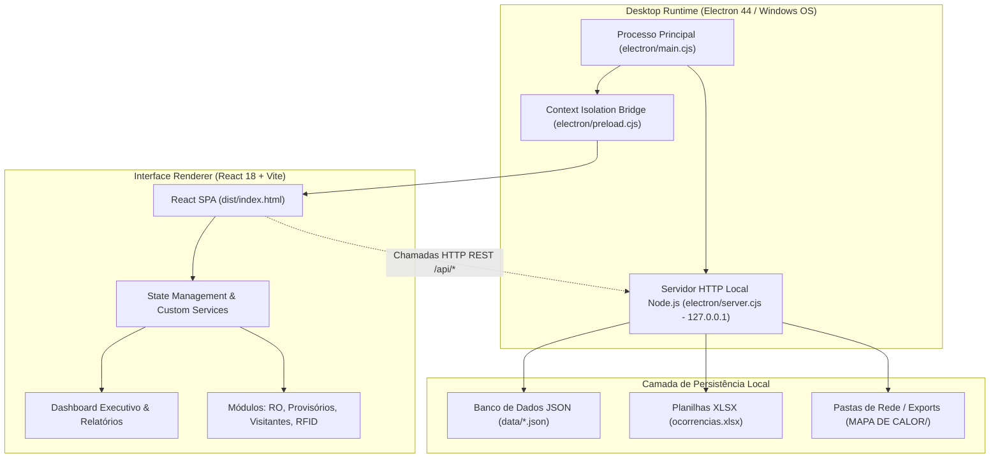

# CCO Security Suite v1.0 | TecPrimus Soluções Tecnológicas
**Desenvolvedor:** Yago Marinho | **Empresa:** TecPrimus Soluções Tecnológicas | **Versão:** 1.0 (2026)  
**Contato:** [LinkedIn](https://www.linkedin.com/in/yago-marinho-b8a309141/) | [GitHub](https://github.com/YagoVasconcelos) | **E-mail:** tecprimus2021@outlook.com

---

# Arquitetura de Software e Guia de Implantação (TI & Engenharia)

## 1. Visão Geral da Arquitetura

O **CCO Security Suite** adota uma arquitetura híbrida moderna que combina a agilidade e reatividade de uma Single Page Application (**React 18 + Tailwind CSS**) com o poder e integração com o sistema operacional providos pelo ecossistema **Electron 44** e **Node.js**.

### 1.1 Diagrama de Arquitetura de Alto Nível



### 1.2 Princípios Arquiteturais
1. **Isolamento de Processos e Segurança:** O processo de renderização não possui acesso irrestrito ao `node:fs` ou `node:child_process`. As chamadas de I/O em disco são mediadas via HTTP interno restrito (`127.0.0.1`) pelo servidor local embutido (`electron/server.cjs`), garantindo conformidade com as melhores práticas do Chromium e Electron.
2. **Resiliência Offline Total:** Nenhuma dependência de CDNs externas, endpoints na nuvem ou serviços de autenticação remota. Fontes, bibliotecas e estilos estão empacotados localmente no bundle de produção.
3. **Persistência Baseada em Arquivos (File-Based Storage):** Os dados são mantidos em arquivos JSON estruturados, legíveis por humanos e fáceis de auditar e realizar backup, eliminando a necessidade de gerenciar serviços de bancos de dados relacionais pesados (como SQL Server ou PostgreSQL) em computadores de portaria.

---

## 2. Estrutura Completa de Diretórios do Projeto

```
CCO/
├── .gitignore                      # Regras rigorosas de sigilo (ignora dados reais de clientes)
├── README.md                       # Documentação executiva na raiz
├── package.json                    # Metadados do software, dependências e scripts de build
├── vite.config.js                  # Configuração do Vite com base relativa (./)
├── tailwind.config.js              # Tokens de design e cores corporativas
├── index.html                      # Ponto de montagem da SPA React
│
├── build/                          # Recursos de compilação do Electron Builder
│   ├── icon.ico                    # Ícone multi-resolução para Windows (256 a 16 px)
│   └── icon.png                    # Ícone PNG máster de 256x256
│
├── public/                         # Assets públicos estáticos
│   ├── shield.svg                  # Vetor original do brasão/escudo
│   ├── icon.ico                    # Ícone para web e atalhos
│   └── icon-256.png                # Imagem de alta resolução
│
├── electron/                       # Código-fonte do Runtime Desktop
│   ├── main.cjs                    # Processo principal (janela maximizada, menus nativos ocultos)
│   ├── preload.cjs                 # Ponte segura de contexto (Context Isolation)
│   └── server.cjs                  # Servidor local Node.js (API REST e persistência de dados)
│
├── data/                           # Armazenamento oficial de dados (JSON)
│   ├── database_template.json      # Template de fábrica limpo e homologado
│   ├── ocorrencias.json            # Base de dados de Relatórios de Ocorrências
│   ├── provisorios.json            # Base de dados de Credenciais Provisórias
│   ├── visitantes.json             # Base de dados de Visitantes
│   ├── rfid.json                   # Base de dados de Chaves e RFID
│   ├── operadores.json             # Lista de Operadores CCO
│   ├── turnos.json                 # Lista de Turnos da Escala
│   ├── observacoes.json            # Lista de Motivos de Provisórios
│   ├── responsaveis.json           # Responsáveis da Planta e Assinaturas
│   └── seguranca.json              # Senha Mestra do Sistema
│
├── templates/                      # Espelho dos modelos de dados para deploy limpo
│   └── database_template.json      # Modelo padrão de inicialização
│
├── scripts/                        # Scripts utilitários de automação
│   ├── clean-data.cjs              # Higienização de dados antes do build (Clean Build)
│   └── generate-icon.cjs           # Gerador automatizado do ícone .ico via Electron
│
├── docs/                           # Documentação Técnica e de Usuário
│   ├── DRS_CCO_Security_Suite.md   # Documento de Requisitos de Software
│   ├── Manual_Usuario_CCO.md       # Manual de Operação do Usuário
│   └── Arquitetura_Implantacao.md  # Este Guia Técnico de TI e Implantação
│
├── src/                            # Código-fonte da aplicação React
│   ├── main.jsx                    # Ponto de entrada do React DOM
│   ├── App.jsx                     # Roteador principal e gerenciamento de telas
│   ├── index.css                   # Estilos globais e utilitários Tailwind
│   │
│   ├── components/                 # Componentes compartilhados
│   │   ├── layout/                 # Layouts (Sidebar, Header corporativo)
│   │   └── common/                 # Modais genéricos (ModalSobre, ModalSenha, etc.)
│   │
│   ├── constants/                  # Matriz oficial de taxonomia corporativa
│   │   └── taxonomiaCco.js         # Prédios, Áreas, Tópicos e Empresas
│   │
│   ├── modules/                    # Módulos de negócio da CCO
│   │   ├── dashboard/              # Dashboard Executivo e Detalhamento Analítico
│   │   ├── ocorrencias/            # Ferramenta 1: Relatório de Ocorrências (RO)
│   │   ├── provisorios/            # Ferramenta 2: Credenciais Provisórias P1 e P2
│   │   ├── visitantes/             # Ferramenta 3: Controle de Visitantes e Slots
│   │   ├── rfid/                   # Ferramenta 4: Gestão de RFID e Chaves
│   │   └── configuracoes/          # Painel de Configurações Administrativas
│   │
│   ├── services/                   # Camada de serviços e regras de negócio
│   │   ├── ocorrenciasService.js   # Regras e chamadas de persistência do RO
│   │   ├── provisoriosService.js   # Regras de limite de 3 acessos e reincidência
│   │   ├── visitantesService.js    # Gerenciamento de slots e checkout de visitantes
│   │   ├── rfidService.js          # Gestão de custódia de chaves
│   │   └── dashboardExportService.js # Compilação de relatórios PDF e bases XLSX
│   │
│   └── server/                     # Plugin de desenvolvimento para o Vite
│       └── apiPlugin.js            # Mock/Middleware de API em tempo de dev
│
└── dist-electron/                  # Artefatos compilados de produção
    ├── CCO Security Suite Setup 1.0.0.exe      # Instalador oficial Windows (NSIS)
    ├── CCO Security Suite Portable 1.0.0.exe   # Executável portátil autônomo
    └── win-unpacked/                           # Pasta de binários descompactada
```

---

## 3. Modelo de Persistência e Storage Engine

### 3.1 Camada de Dados em Arquivos JSON
Cada entidade do sistema é armazenada em seu respectivo arquivo JSON estruturado em `data/`:
* `ocorrencias.json`: Array de objetos contendo `numeroRO`, `data`, `hora`, `local`, `topico`, `envolvidos`, `fotosBase64`, `nomeArquivoPdf`.
* `provisorios.json`: Array de movimentações de credenciais com `nome`, `empresa`, `cartao`, `portaria`, `dataRetirada`, `horaRetirada`, `dataDevolucao`, `horaDevolucao`, `motivo`.
* `visitantes.json`: Array de visitas com `nome`, `documento`, `empresa`, `contato`, `portaria`, `crachá`, `dataEntrada`, `horaEntrada`, `status`.
* `seguranca.json`: Objeto contendo `{ senhaMestra: "...", dataAtualizacao: "..." }`.

### 3.2 Estratégia de Caminhos de Armazenamento em Produção
Para assegurar que o aplicativo funcione tanto em computadores com privilégios restritos de usuário quanto em modo portátil via Pen Drive, o processo principal ([electron/main.cjs](file:///c:/Users/YAGO_ADS_TP/Desktop/CCO/electron/main.cjs)) implementa uma estratégia de detecção de permissão de escrita:
1. **Modo Portátil / Pasta Local:** O software verifica se o diretório do próprio `.exe` é gravável (tentando escrever um arquivo temporário de teste). Em caso positivo, o banco de dados e os relatórios ficam salvos no diretório local `./data` e `./exports`.
2. **Modo Instalado no Sistema (Fallback Seguro):** Caso o programa tenha sido instalado em pasta restrita pelo administrador (ex: `C:\Program Files\`), o caminho é redirecionado transparentemente para a pasta protegida de dados do usuário:
   `%APPDATA%\CCO Security Suite\database\data\`

### 3.3 Inicialização Automática de Fábrica (`initializeCleanDataIfMissing`)
Ao iniciar em um computador virgem pela primeira vez, o servidor Node.js embutido verifica se os arquivos JSON existem. Se não existirem, ele copia e instancia instantaneamente a estrutura limpa a partir de `data/database_template.json`.

---

## 4. Guia de Compilação e Deploy (Passo a Passo)

### 4.1 Pré-requisitos na Máquina de Desenvolvimento
* **Sistema Operacional:** Windows 10 ou 11 (64-bit).
* **Node.js:** Versão 18.x ou superior (LTS recomendada).
* **NPM:** Versão 9.x ou superior.
* **Git:** Para versionamento e controle de código.

### 4.2 Instalação das Dependências
Abra o PowerShell ou Terminal no diretório raiz do projeto e execute:
```bash
npm install
```
*(No PowerShell do Windows com restrições de script, use `npm.cmd install`)*

---

### 4.3 Comandos de Compilação e Empacotamento

| Comando | Descrição Técnica |
| :--- | :--- |
| `npm run electron:dev` | Inicia o servidor Vite e o Electron simultaneamente com Hot-Reload para testes e depuração. |
| `npm run clean:data` | Executa o script de higienização que zera os bancos de dados aplicando o template oficial. |
| `npm run generate:icon` | Renderiza o `shield.svg` e compila o `build/icon.ico` com 6 resoluções nativas. |
| **`npm run build:exe`** | **Gera o Instalador Oficial (.exe NSIS)** com assistente de instalação, atalhos na Área de Trabalho e Menu Iniciar. |
| **`npm run build:portable`** | **Gera o Executável Portátil (.exe único)** pronto para rodar direto de um pen drive ou pasta sem instalação. |
| **`npm run build:all`** | Compila tanto o Instalador quanto o Portátil na mesma execução. |

---

### 4.4 Procedimento para Implantação Limpa (Clean Deploy) em uma Nova Máquina

1. **Gere os arquivos de produção** na máquina de desenvolvimento executando:
   ```bash
   npm run build:all
   ```
2. **Localize os arquivos gerados** na pasta `dist-electron/`:
   * `CCO Security Suite Setup 1.0.0.exe` (Instalador Padrão)
   * `CCO Security Suite Portable 1.0.0.exe` (Executável Portátil)
3. **Transferência para a Máquina de Produção:**
   * Copie o instalador ou executável para a estação de trabalho da Central de Controle Operacional (via rede interna ou pen drive seguro).
4. **Instalação:**
   * Dê dois cliques em `CCO Security Suite Setup 1.0.0.exe`.
   * Escolha o diretório de destino (padrão do usuário ou pasta customizada).
   * O instalador criará o atalho com o ícone corporativo do escudo na Área de Trabalho.
5. **Primeiro Acesso:**
   * Abra o aplicativo. A janela abrirá automaticamente maximizada.
   * Acesse o menu **Configurações** usando a Senha Mestra padrão: **`admin123`**.
   * Cadastre os operadores de plantão e altere a Senha Mestra para a chave definitiva da organização.

---

## 5. Rotinas de Backup e Recuperação de Desastres

* **Onde estão os dados?** Todos os registros operacionais residem no diretório `data/` (ou em `%APPDATA%\CCO Security Suite\database\data\`).
* **Como fazer Backup:**
  Basta copiar a pasta `data/` inteira para um disco seguro, storage de rede ou pasta compartilhada corporativa periodicamente.
* **Como Restaurar:**
  Basta colar os arquivos da pasta de backup de volta no diretório `data/` do aplicativo com o software fechado e reabrir o sistema. Todos os relatórios, históricos e senhas estarão 100% restaurados.

---
*Manual técnico homologado para a equipe de Tecnologia da Informação e Segurança Patrimonial.*
