# CCO Security Suite Rev 1.1 | TecPrimus Soluções Tecnológicas
**Desenvolvedor:** Yago Marinho | **Empresa:** TecPrimus Soluções Tecnológicas | **Versão:** Rev 1.1 (2026)  
**Contato:** [LinkedIn](https://www.linkedin.com/in/yago-marinho-b8a309141/) | [GitHub](https://github.com/YagoVasconcelos) | **E-mail:** tecprimus2021@outlook.com

---

# Arquitetura de Software e Guia de Implantação (TI & Engenharia) — Rev 1.1

## 1. Visão Geral da Arquitetura

O **CCO Security Suite (Rev 1.1)** adota uma arquitetura híbrida de alta performance que combina a reatividade de uma Single Page Application (**React 18 + Tailwind CSS**) com o poder e integração com o sistema operacional providos pelo ecossistema **Electron 44** e **Node.js**.

### 1.1 Diagrama de Arquitetura de Alto Nível

```mermaid
graph TD
    subgraph "Desktop Runtime (Electron 44 / Windows OS)"
        MainProcess["Processo Principal (electron/main.cjs)"]
        PreloadBridge["Context Isolation Bridge (electron/preload.cjs)"]
        IPCHandlers["IPC Dialog Handlers (Open/Save File & Directory)"]
        CryptoModule["Criptografia & Blindagem (electron/cryptoHelper.cjs)"]
        EmbeddedServer["Servidor HTTP Local Node.js (electron/server.cjs - 127.0.0.1:3000)"]
    end

    subgraph "Camada de Persistência Local & Criptográfica"
        JSONFiles["Banco de Dados JSON (data/*.json + cargos.json)"]
        SecureStore["Senha Mestra Blindada (safeStorage DPAPI / PBKDF2-SHA512)"]
        ExcelFiles["Planilhas XLSX (ocorrencias.xlsx)"]
        BackupFiles["Backups Estruturados (.json via SaveDialog)"]
        NetworkShare["Pastas de Rede / Exports (Salvamento Concorrente)"]
    end

    subgraph "Interface Renderer (React 18 + Vite)"
        ReactSPA["React SPA (dist-react/index.html)"]
        RouterState["State Management & Eventos Globais (cco_cargos_changed)"]
        SortableHeader["SortableHeader (Ordenação Bidirecional em 100% das Tabelas)"]
        KeyboardManager["ModalKeyboardManager (Acessibilidade ESC / Enter)"]
        BackupService["backupService.js (Merge Inteligente Anti-Duplicidade)"]
        ROPrintEngine["RelatorioOcorrenciaOficialDocumento.jsx (@media print Retrato)"]
        DashboardLandscape["Dashboard Executivo 4 Módulos (A4 Landscape Print)"]
        CobrancaModal["ModalCobrancaSegundaVia (Taxa Fixa R$ 30,00)"]
        ModulesViews["Módulos: RO, Provisórios, Visitantes, RFID, Cargos, Config"]
    end

    MainProcess --> PreloadBridge
    MainProcess --> IPCHandlers
    MainProcess --> CryptoModule
    MainProcess --> EmbeddedServer
    CryptoModule --> SecureStore
    IPCHandlers --> BackupFiles
    IPCHandlers --> NetworkShare
    EmbeddedServer --> JSONFiles
    EmbeddedServer --> ExcelFiles
    EmbeddedServer --> NetworkShare
    PreloadBridge --> ReactSPA
    ReactSPA --> RouterState
    RouterState --> SortableHeader
    RouterState --> KeyboardManager
    RouterState --> BackupService
    RouterState --> ROPrintEngine
    RouterState --> DashboardLandscape
    RouterState --> CobrancaModal
    RouterState --> ModulesViews
    ReactSPA -.->|Chamadas HTTP REST /api/*| EmbeddedServer
    ReactSPA -.->|Invocação IPC Segura window.electronAPI| PreloadBridge
```



### 1.2 Princípios Arquiteturais e Diretrizes de Engenharia
1. **Isolamento de Processos e Segurança Criptográfica:** O processo de renderização não possui acesso irrestrito ao `node:fs` ou `node:child_process`. O acesso a disco é mediado via HTTP interno estrito (`127.0.0.1:3000`) pelo servidor local embutido (`electron/server.cjs`) e via IPC com canal seguro no `preload.cjs`. A segurança de credenciais é garantida pelo módulo `cryptoHelper.cjs`, que utiliza **Windows DPAPI (`safeStorage`)** com fallback robusto para **PBKDF2-HMAC-SHA512 (100.000 iterações)**, eliminando senhas em texto plano.
2. **Resiliência Offline Total:** Nenhuma dependência de CDNs externas, endpoints na nuvem ou serviços de autenticação remota. Fontes, ícones (Lucide), bibliotecas e estilos Tailwind estão empacotados localmente no bundle de produção.
3. **Persistência Baseada em Arquivos (File-Based Storage):** Os dados são mantidos em arquivos JSON estruturados, legíveis por humanos e fáceis de auditar e realizar backup, eliminando a necessidade de gerenciar serviços de bancos de dados relacionais pesados em computadores de portaria.
4. **Matriz Dinâmica de Cargos & Governança de Perfis:**
   * **Operadores CCO (`operadores.json`):** Contas autorizadas com login no software, manipulação de ocorrências, supervisão do dashboard e rotinas administrativas sob Senha Mestra.
   * **Efetivo de Vigilância de Campo (`vigilantes.json`):** Vigilantes físicos alocados nas Portarias 1 e 2 e Ronda, cadastrados exclusivamente para vínculo de responsabilidade na concessão e baixa de cartões provisórios, sem acesso às telas do software.
   * **Matriz de Cargos e Funções (`cargos.json`):** Estrutura hierárquica centralizada que alimenta reativamente todos os formulários da aplicação através do evento global `cco_cargos_changed`.
5. **Dashboard Executivo de 4 Módulos com Paginação Limpa e Isolamento de Filtros:** Visualização analítica estruturada em 4 módulos paisagem independentes (Ocorrências, Provisórios, Visitantes e RFID & Contabilidade) com suporte a drill-down interativo e exportação em A4 Landscape de alta definição.

---

## 2. Estrutura Completa de Diretórios do Projeto

```
CCO/
├── .gitignore                      # Regras rigorosas de sigilo corporativo
├── README.md                       # Documentação executiva na raiz do repositório
├── Makefile                        # Automação de comandos rápidos (make dev, make build, etc.)
├── package.json                    # Metadados do software, dependências e scripts de build
├── vite.config.js                  # Configuração do Vite com base relativa (./) e outDir dist-react
├── tailwind.config.js              # Tokens de design corporativo (Dark Mode Slate-950)
├── postcss.config.js               # Pipeline PostCSS para processamento de estilos
├── index.html                      # Ponto de montagem da SPA React
├── icon.ico                        # Ícone do aplicativo multi-resolução para Windows
├── cargos.json                     # Matriz corporativa centralizada de cargos e funções
│
├── build/                          # Recursos de compilação do Electron Builder
│   ├── icon.ico                    # Ícone multi-resolução para Windows (256 a 16 px)
│   └── icon.png                    # Ícone PNG máster de 256x256
│
├── public/                         # Assets públicos estáticos
│   ├── shield.svg                  # Vetor original do brasão/escudo
│   ├── icon.ico                    # Ícone para web e atalhos
│   └── icon-256.png                # Imagem de alta resolução
│
├── electron/                       # Código-fonte do Runtime Desktop
│   ├── main.cjs                    # Processo principal (janela, menus, IPC handlers nativos)
│   ├── preload.cjs                 # Ponte segura de contexto (Context Isolation Bridge)
│   ├── server.cjs                  # Servidor local Node.js (API REST, merge e persistência)
│   └── cryptoHelper.cjs            # Envoltório de blindagem criptográfica e DPAPI safeStorage
│
├── data/                           # Armazenamento oficial de dados (JSON)
│   ├── database_template.json      # Template de fábrica limpo e homologado (Clean State)
│   ├── ocorrencias.json            # Base de dados de Relatórios de Ocorrências (RO)
│   ├── provisorios.json            # Base de dados de Credenciais Provisórias (P1 e P2)
│   ├── visitantes.json             # Base de dados de Visitantes e Slots de Acesso
│   ├── rfid.json                   # Base de dados de Chaves e Tags RFID
│   ├── operadores.json             # Lista de Operadores CCO (Central com Login)
│   ├── vigilantes.json             # Efetivo de Vigilância de Campo (Portarias/Ronda)
│   ├── turnos.json                 # Lista de Turnos da Escala (12x36 D/N, Adm)
│   ├── observacoes.json            # Lista de Motivos de Provisórios (Esqueceu, Perdeu, etc.)
│   ├── responsaveis.json           # Responsáveis da Planta, Assinaturas e Caminho de Rede
│   └── seguranca.json              # Senha Mestra Blindada (CCO_SECURE_V2)
│
├── templates/                      # Espelho dos modelos de dados para deploy limpo
│   └── database_template.json      # Modelo padrão de inicialização
│
├── scripts/                        # Scripts utilitários de automação e compilação
│   ├── clean-data.cjs              # Higienização de dados antes do build (Clean Build)
│   ├── generate-icon.cjs           # Gerador automatizado do ícone .ico via Electron
│   ├── generate-pdf-docs.cjs       # Compilador oficial dos PDFs ABNT (Rev 1.1)
│   └── build-manual-pdf.cjs        # Compilador do Manual do Usuário Markdown para PDF
│
├── docs/                           # Documentação Técnica e de Usuário Oficial
│   ├── DRS_CCO_Security_Suite.md   # Documento de Requisitos de Software
│   ├── Manual_Usuario_CCO.md       # Manual de Operação do Usuário Final
│   ├── Arquitetura_Implantacao.md  # Este Guia Técnico de TI e Implantação
│   └── prints/                     # Capturas de tela para compilação dos manuais
│
├── src/                            # Código-fonte da aplicação React
│   ├── main.jsx                    # Ponto de entrada do React DOM
│   ├── App.jsx                     # Roteador principal e gerenciamento de abas
│   ├── index.css                   # Estilos globais corporativos e regras de impressão (@media print)
│   │
│   ├── components/                 # Componentes reutilizáveis
│   │   ├── layout/                 # Layouts (Sidebar corporativa, Header de status)
│   │   ├── common/                 # Modais (ModalSobre, ModalSenha, SortableHeader, ModalKeyboardManager)
│   │   │   ├── SortableHeader.jsx           # Cabeçalho com ordenação bidirecional interativa
│   │   │   └── ModalKeyboardManager.jsx     # Gerenciamento de acessibilidade de teclado (ESC / Enter)
│   │   └── ui/                     # Componentes atômicos de interface (Botões, Badges, Cards)
│   │
│   ├── constants/                  # Matrizes de taxonomia oficial
│   │   └── taxonomiaCco.js         # Prédios, Áreas, Tópicos, Empresas e normalizador de gravidade
│   │
│   ├── modules/                    # Módulos de negócio da CCO
│   │   ├── dashboard/              # Console Executivo Analítico
│   │   │   ├── DashboardExecutivoView.jsx     # View com 4 módulos paisagem e drill-down
│   │   │   ├── RelatorioExecutivoPrint.jsx    # Motor de impressão A4 Landscape
│   │   │   └── ModalCobrancaSegundaVia.jsx    # Modal de cobrança da taxa fixa de R$ 30,00
│   │   ├── ocorrencias/            # Ferramenta 1: Relatório de Ocorrências (RO)
│   │   │   ├── RelatorioOcorrenciaForm.jsx            # Formulário de Cadastro e Edição
│   │   │   └── RelatorioOcorrenciaOficialDocumento.jsx # Template Linear Oficial Limpo
│   │   ├── provisorios/            # Ferramenta 2: Credenciais Provisórias P1 e P2
│   │   ├── visitantes/             # Ferramenta 3: Controle de Visitantes e Slots
│   │   ├── rfid/                   # Ferramenta 4: Gestão de RFID e Claviculário
│   │   └── configuracoes/          # Painel de Configurações Administrativas
│   │       ├── PainelBackupRestauracao.jsx    # Central de Backup & Merge Inteligente
│   │       ├── GerenciadorCargosModal.jsx     # Gestão centralizada de Cargos e Funções
│   │       └── GerenciadorSegurancaModal.jsx   # Gestão de Senha Mestra com validação criptográfica
│   │
│   ├── services/                   # Camada de serviços e regras de negócio
│   │   ├── backupService.js        # Lógica de Exportação e Merge Anti-Duplicidade
│   │   ├── cargosService.js        # Gestão reativa da matriz de cargos
│   │   ├── ocorrenciasService.js   # Persistência e regras de negócio de RO
│   │   ├── provisoriosService.js   # Regras de limite de 3 acessos e taxa de 2ª via
│   │   ├── visitantesService.js    # Gerenciamento de slots e checkout de visitantes
│   │   ├── rfidService.js          # Gestão de custódia e inventário de RFID
│   │   ├── segurancaService.js     # Comunicação com o backend para validação de senha
│   │   └── dashboardExportService.js # Compilação de relatórios PDF (Paisagem) e planilhas XLSX
│   │
│   └── server/                     # Middleware e lógica de backend embutido
│       ├── apiPlugin.js            # Endpoints da API REST local para modo dev Vite
│       └── cryptoHelper.cjs        # Implementação de PBKDF2-HMAC-SHA512 e safeStorage
│
└── dist/                           # Artefatos compilados de produção (Electron Builder)
    ├── CCO Security Suite Setup 1.1.0.exe      # Instalador oficial Windows (NSIS)
    ├── CCO Security Suite Portable 1.1.0.exe   # Executável portátil autônomo
    └── win-unpacked/                           # Pasta de binários descompactada para testes
```

---

## 3. Modelo de Persistência, Segurança & Storage Engine

### 3.1 Camada de Dados em Arquivos JSON Estruturados
Cada entidade do sistema é armazenada em seu respectivo arquivo JSON estruturado em `data/` (com espelhamento em memória e `localStorage`):
* `ocorrencias.json`: Array de objetos contendo `numeroRO`, `data`, `hora`, `local`, `topico`, `gravidade`, `envolvidos`, `fotosBase64`, `nomeArquivoPdf`.
* `provisorios.json`: Array de movimentações de credenciais com `nome`, `empresa`, `cartao`, `portaria`, `vigilante`, `dataRetirada`, `horaRetirada`, `dataDevolucao`, `horaDevolucao`, `motivo`, `taxaSegundaVia`.
* `visitantes.json`: Array de visitas com `nome`, `documento`, `empresa`, `anfitriao`, `portaria`, `cracha`, `dataEntrada`, `horaEntrada`, `status`.
* `rfid.json`: Inventário de chaves mestras e tags RFID (`codigoRfid`, `codigoVerso`, `tipo`, `status`, `cautelaAtiva`).
* `cargos.json`: Matriz corporativa de funções (`id`, `nome`, `tipo`, `status`, `dataCadastro`).
* `operadores.json`: Membros da equipe da Central CCO autorizados a operar o software.
* `vigilantes.json`: Efetivo operacional de campo (Portarias 1 e 2, Ronda) para vínculo nas credenciais.
* `responsaveis.json`: Parâmetros de assinaturas corporativas (Gerência, Coordenação, Fiscal) e diretório de rede configurado (`caminhoRede`).
* `turnos.json`: Escalas operacionais cadastradas (ex: 12x36 Diurno, 12x36 Noturno, Administrativo).
* `observacoes.json`: Motivos parametrizados para credenciais temporárias (Esqueceu, Perdeu, Defeito, etc.).
* `seguranca.json`: Objeto de credencial blindada contendo o hash criptográfico ou cifra DPAPI.

---

### 3.2 Blindagem Criptográfica de Senhas (`cryptoHelper.cjs`)
A suíte implementa proteção de nível bancário contra extração indevida ou violação física do disco:
1. **Camada 1 — Windows Data Protection API (DPAPI via Electron `safeStorage`):**
   * Quando executado no Windows através do Electron, o sistema criptografa as credenciais sensíveis utilizando a chave atrelada ao perfil de usuário do sistema operacional (`safeStorage.encryptString`). Mesmo que o arquivo `data/seguranca.json` seja copiado para outra máquina, a credencial não pode ser descriptografada.
2. **Camada 2 — PBKDF2-HMAC-SHA512 com Salt Criptográfico:**
   * Utiliza o padrão criptográfico `CCO_SECURE_V2`: **Salt aleatório de 32 bytes (256 bits)**, **100.000 iterações** de função pseudoaleatória com **HMAC-SHA512** e chave derivada de 64 bytes (512 bits).
3. **Proteção Contra Timing Attacks:**
   * A validação de senhas é realizada via `crypto.timingSafeEqual`, impedindo que atacantes descubram o comprimento ou conteúdo da senha medindo o tempo de resposta da CPU.
4. **Auto-Migração Transparente:**
   * Ao detectar qualquer registro legado em texto plano, o sistema calcula o hash blindado imediatamente e regrava o arquivo `data/seguranca.json`, eliminando permanentemente qualquer rastro em texto legível.

---

### 3.3 Matriz de Cargos e Funções Centralizada & Reatividade Global
* **Arquivo `cargos.json`:** Concentra todas as nomenclaturas corporativas homologadas (Operadores de Central, Técnicos, Vigilantes Líderes, Vigilantes de Portaria, Bombeiros Civis, Fiscais, etc.).
* **Consistência Cruzada:**
  * O formulário de cadastro de **Operadores** consome as funções do tipo `OPERADOR`.
  * O formulário de cadastro de **Vigilantes** consome as funções do tipo `VIGILANTE`.
  * A tabela de **Envolvidos no Relatório de Ocorrências (RO)** oferece autocomplete inteligente baseado nas funções cadastradas.
* **Barramento de Eventos Reativo:** Qualquer inclusão, alteração ou exclusão de cargo dispara o evento `window.dispatchEvent(new CustomEvent('cco_cargos_changed'))`, sincronizando todos os módulos da interface instantaneamente sem necessidade de recarregar a aplicação.

---

### 3.4 Gestão de Diretórios Nativos & Nomenclatura Dinâmica de Exportação
1. **Seleção Nativa via IPC (`dialog:openDirectory`):**
   * O operador seleciona pastas locais ou compartilhamentos corporativos através da caixa de diálogo nativa do Windows Explorer (`dialog.showOpenDialog({ properties: ['openDirectory'] })`), garantindo compatibilidade com unidades mapeadas e caminhos UNC (`\\servidor\compartilhamento`).
2. **Redundância e Salvamento Concorrente:**
   * Todo documento emitido (RO ou Relatório Executivo) é gravado simultaneamente na pasta configurada pelo usuário e espelhado de forma inviolável no diretório seguro do sistema em `%USERPROFILE%\Documents\CCO Security Suite\exports`.
3. **Padrão Oficial de Nomenclatura de Arquivos:**
   * **Relatório de Ocorrência (RO):** `Ocorrência [Protocolo RO] - [Tópico] & [Gravidade] - [Data].pdf`
   * **Relatório Executivo Consolidado:** `Relatorio_Executivo_CCO_[Periodo]_[Data].pdf`
   * **Cobrança de 2ª Via / Ressarcimento:** `Cobranca_2via_Credencial_[Colaborador]_[Data].pdf`
   * **Backup Geral do Sistema:** `backup_cco_YYYY-MM-DD_HH-mm-ss.json`

---

### 3.5 Padronização da Taxa Financeira de 2ª Via (R$ 30,00) & Modal de Cobrança
* **Isolamento de Escopo:** Em estrito cumprimento às normas de governança corporativa, os **Relatórios de Ocorrência (RO)** são terminantemente proibidos de conter campos, cálculos ou estimativas financeiras (foco estritamente na apuração dos fatos patrimoniais).
* **Taxa Fixa Administrativa:** Para controle de credenciais (Provisórios, RFID e Visitantes), qualquer cartão extraviado ou não devolvido gera a cobrança administrativa fixa de **R$ 30,00** para custeio da 2ª via física.
* **Modal e Ficha de Cobrança em PDF:** O Dashboard disponibiliza o botão **Cobrança 2ª Via**, permitindo selecionar inadimplências e emitir a **Ficha Oficial de Cobrança em PDF** (`Cobranca_2via_Credencial_*.pdf`) com protocolo, identificação do colaborador, empresa prestadora e dados bancários/financeiros da organização para desconto em fatura corporativa.

---

### 3.6 Módulo de Backup & Restauração (Merge Inteligente Anti-Duplicidade)
O sistema conta com um pipeline avançado de proteção e consolidação de dados implementado em `src/services/backupService.js`:
* **Exportação Unificada (`dialog:salvarArquivoBackup`):** Coleta todos os arquivos JSON e gera uma imagem única e íntegra (`backup_cco_YYYY-MM-DD_HH-mm-ss.json`).
* **Restauração Segura com Diagnóstico Prévio:** Antes de aplicar qualquer alteração, o sistema analisa o arquivo selecionado e exibe contadores em tempo real de novos registros, registros já existentes e duplicidades evitadas.
* **Algoritmo de Fusão Não-Destrutiva:** A fusão é orientada por chaves primárias imutáveis (`numeroRO`, chave composta de crachá/data/hora de provisórios, RG/data/hora de visitantes e matrícula de operadores/vigilantes). Registros existentes são 100% preservados, registros inéditos são adicionados e colisões são descartadas de forma atômica.

---

## 4. Pipeline de Impressão e Relatórios Oficiais

### 4.1 Estrutura Linear Estrita do Documento Oficial de Ocorrência (RO)
O componente `RelatorioOcorrenciaOficialDocumento.jsx` e as regras de `@media print` no `index.css` asseguram que o documento impresso seja idêntico ao padrão pericial homologado:
```
┌────────────────────────────────────────────────────────────────────────┐
│ CCO SECURITY SUITE CENTRAL DE CONTROLE OPERACIONAL                     │
│ SEGURANÇA PATRIMONIAL & CONTROLE DE ACESSO — OPERADOR: [NOME]          │
│ ─────────────────────────────────────── [ RO-2026-XXXX | GRAVIDADE ]   │
├────────────────────────────────────────────────────────────────────────┤
│ RELATÓRIO DE OCORRÊNCIA (RO)                                           │
│ Documento emitido para apuração, registro de fatos e controle...       │
├────────────────────────────────────────────────────────────────────────┤
│ APROVADORES (GRID SUPERIOR FIXO NO TOPO)                               │
│ [ Gerente de Site ]    [ Coordenação Segurança ]    [ Fiscal Contrato ]│
├────────────────────────────────────────────────────────────────────────┤
│ 1. DADOS GERAIS DO FATO                                                │
│ [ Data do Fato ]   [ Horário ]   [ Prédio / Área ]   [ Tópico & Grav. ]│
├────────────────────────────────────────────────────────────────────────┤
│ TÍTULO: [Nome Resumido da Ocorrência]                                  │
├────────────────────────────────────────────────────────────────────────┤
│ 2. RELATO CRONOLÓGICO DOS FATOS (Texto corrido e imparcial)            │
├────────────────────────────────────────────────────────────────────────┤
│ 3. ENVOLVIDOS/IDENTIFICAÇÃO DE PESSOAS (Tabela formal #, Nome, Cargo)  │
├────────────────────────────────────────────────────────────────────────┤
│ 4. REGISTRO FOTOGRÁFICO / ANEXO DE IMAGENS (Grade 2 cols com legendas) │
├────────────────────────────────────────────────────────────────────────┤
│ RODAPÉ DE AUDITORIA: CCO Security Suite • Protocolo • Data • Pág 1 de 1│
└────────────────────────────────────────────────────────────────────────┘
```

### 4.2 Isenção de Poluição Visual (@media print)
* Aplicação de `page-break-inside: avoid` em cards, tabelas e evidências fotográficas.
* Ocultação compulsória de barras de navegação, botões de ação, campos editáveis e modais.
* Remoção de assinaturas visuais truncadas e códigos desnecessários que poluam a formalidade do documento.

### 4.3 Pipeline do Dashboard Executivo em 4 Módulos Paisagem (A4 Landscape)
* **Paginação Limpa e Contínua:** Implementada no componente `RelatorioExecutivoPrint.jsx` e estilizada com `@page { size: A4 landscape; margin: 8mm; }`, garantindo que cada um dos 4 dashboards ocupe exatamente uma página paisagem independente (`page-break-after: always`).
* **Interatividade com Drill-down de Gravidade:** O gráfico de distribuição de severidade (Crítica, Alta, Média, Baixa) opera com botões interativos que aplicam filtros instantâneos às tabelas analíticas inferiores com feedback visual ativo (anéis e efeitos de brilho).
* **Isolamento Estrito de Filtros:**
  * O **Filtro Temporal (Data)** atua de forma transversal sobre todos os 4 dashboards.
  * Os **Filtros de Ocorrências (Prédio, Área, Tópico e Gravidade)** impactam exclusivamente o Dashboard 1 (Ocorrências).
  * O **Filtro de Empresa** impacta exclusivamente os Dashboards 2, 3 e 4 (Provisórios, Visitantes e RFID), garantindo que a filtragem por prestadora jamais oculte incidentes de segurança patrimonial da planta.

---

## 5. Ergonomia de Interface, Acessibilidade e Componentes Padronizados

### 5.1 Ordenação Bidirecional Padronizada (`SortableHeader`)
* Todas as tabelas de listagem da suíte (Ocorrências, Provisórios, Visitantes, RFID, Operadores e Vigilantes) utilizam o componente reutilizável `SortableHeader`.
* Fornece indicadores visuais de ordenação (setas para cima/baixo) com suporte a tipos de dados alfanuméricos, datas e numéricos, agilizando auditorias e cruzamentos de informações em tempo real.

### 5.2 Gerenciamento de Foco e Teclado (`ModalKeyboardManager`)
* Todos os modais e caixas de diálogo do sistema contam com controle de teclado nativo:
  * Tecla **`ESC`**: Fecha o modal em primeiro plano de forma segura sem perder dados em formulários principais.
  * Tecla **`Enter`**: Aciona a ação primária de confirmação quando os campos estão devidamente preenchidos.
  * Retenção de foco para prevenir que interações operacionais atinjam elementos de fundo da aplicação.

---

## 6. Guia de Compilação e Deploy (Passo a Passo)

### 6.1 Pré-requisitos na Máquina de Desenvolvimento
* **Sistema Operacional:** Windows 10 ou 11 (64-bit).
* **Node.js:** Versão 18.x ou superior (LTS recomendada).
* **NPM:** Versão 9.x ou superior.
* **Git:** Para versionamento de código.

### 6.2 Comandos de Compilação e Empacotamento

| Comando | Descrição Técnica |
| :--- | :--- |
| `npm run dev` | Inicia o servidor Vite em modo web convencional. |
| `npm run electron:dev` | Inicia o servidor Vite e o runtime Electron simultaneamente com Hot-Reload. |
| `npm run clean:data` | Executa o script de higienização que restaura o banco ao template limpo oficial. |
| `npm run generate:icon` | Compila o ícone `build/icon.ico` com múltiplas resoluções nativas (256 a 16 px). |
| `npm run generate:docs-pdf` | Gera os 3 PDFs oficiais homologados pelas normas ABNT na pasta `docs/`. |
| `npm run build:pdf` | Compila o Manual do Usuário Markdown para PDF ilustrado. |
| **`npm run build:exe`** | **Gera o Instalador Oficial (.exe NSIS)** com assistente de instalação e atalhos. |
| **`npm run build:portable`** | **Gera o Executável Portátil (.exe único)** autônomo sem necessidade de instalação. |
| **`npm run build:all`** | Compila simultaneamente o Instalador e o Portátil na pasta `dist/`. |

---

## 7. Rotinas de Backup e Recuperação de Desastres

* **Localização Física dos Dados:** Todos os registros operacionais residem no diretório `data/` do projeto (ou em `%APPDATA%\CCO Security Suite\database\data\` em instalações em produção).
* **Rotina de Backup Preventivo:**  
  Acesse a aba **Configurações** mediante validação da Senha Mestra e clique em **Fazer Backup / Exportar**. O arquivo gerado conterá a imagem consolidada e estruturada de todas as bases.
* **Procedimento de Restauração em Contingência:**  
  Acesse **Configurações** > **Restaurar Backup / Importar**, selecione o arquivo de backup e analise o sumário de diagnóstico. O mecanismo de **Merge Inteligente** integrará todos os registros inéditos sem perdas e sem duplicidades.

---
*Documento de Arquitetura e Engenharia de Software homologado para a equipe de TI e Operações de Segurança Patrimonial (Rev 1.1).*

