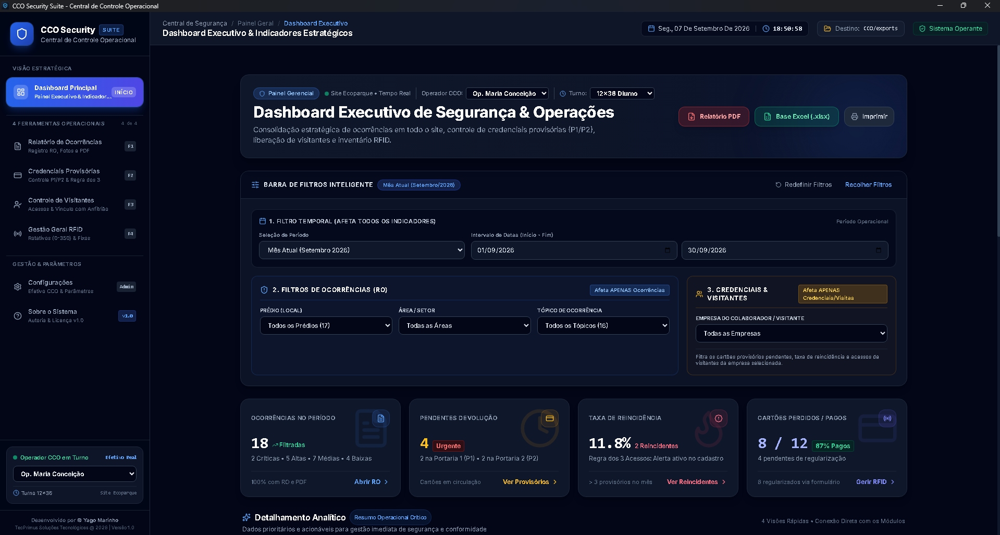
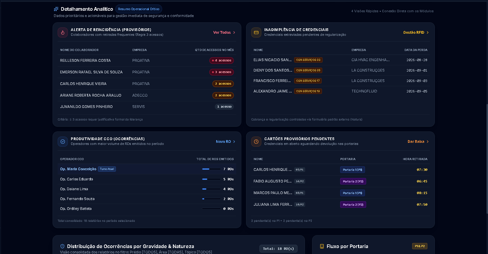
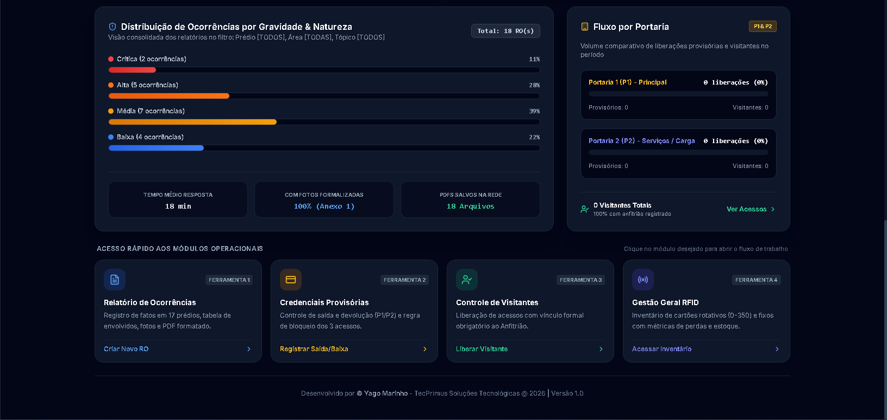
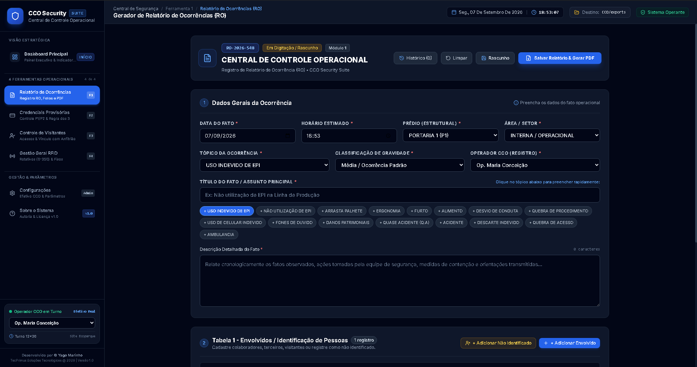
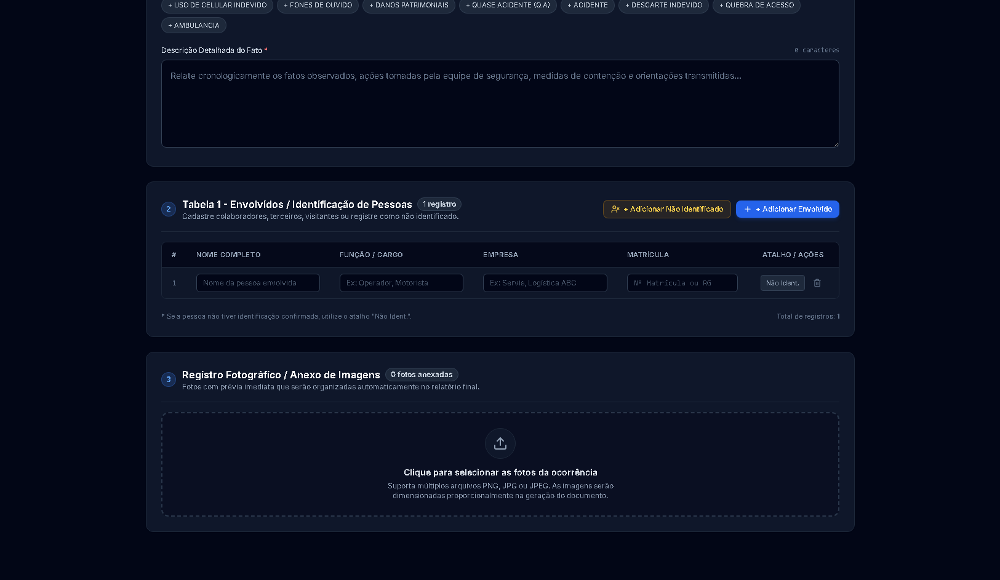
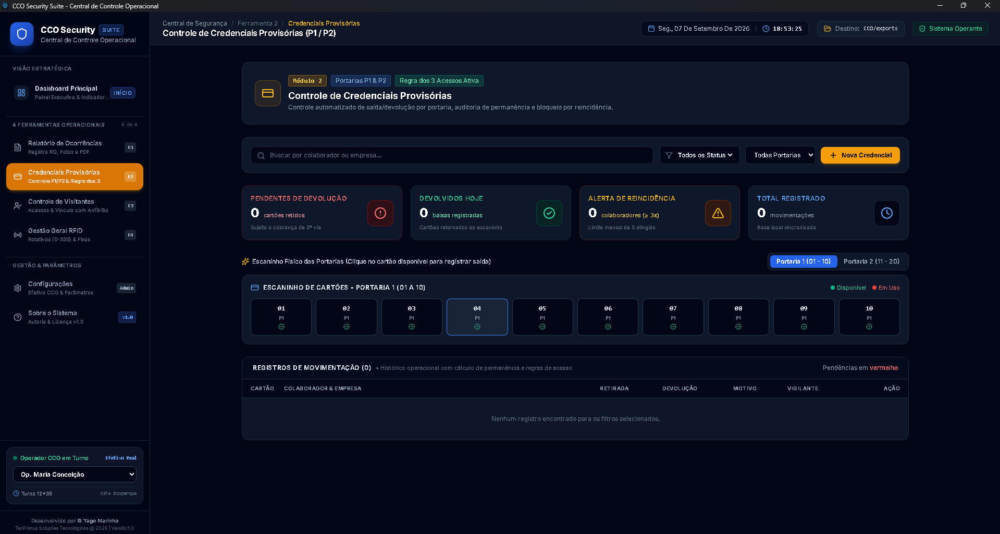
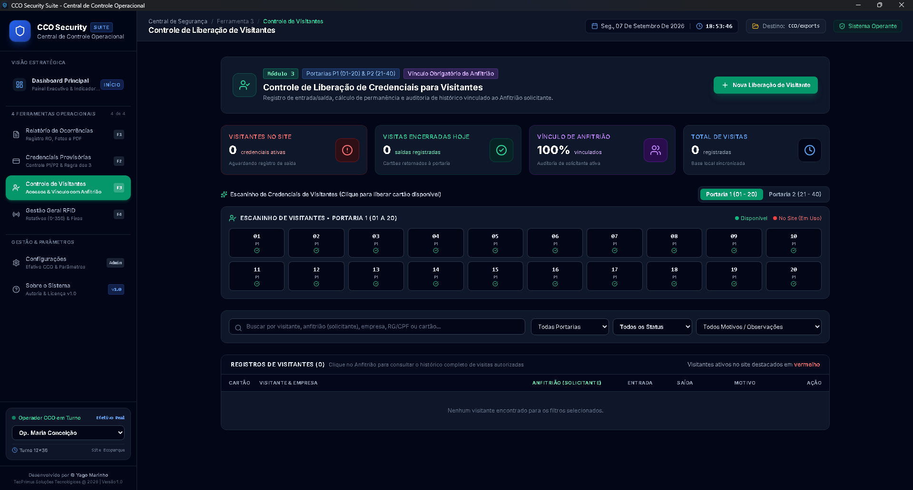
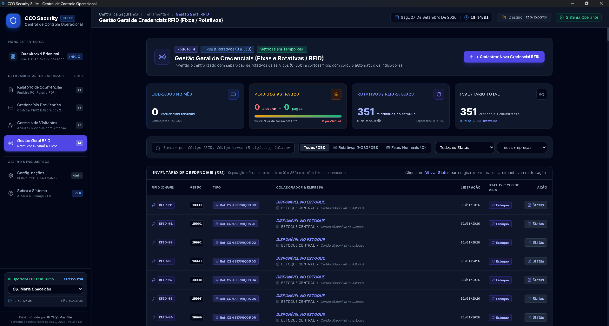
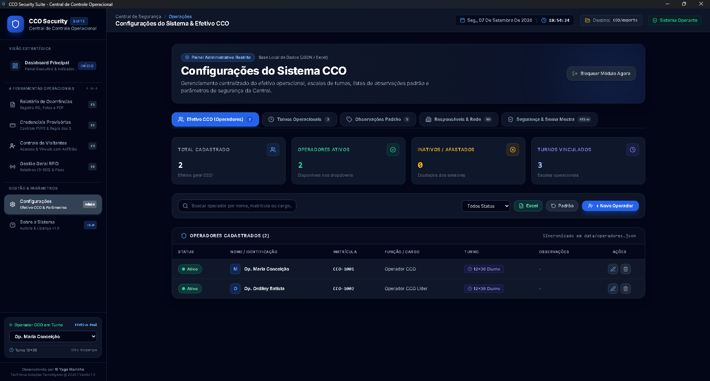
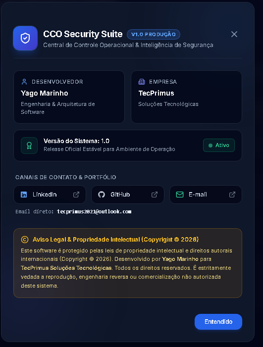

# CCO Security Suite Rev 1.0 | TecPrimus Soluções Tecnológicas
**Desenvolvedor:** Yago Marinho | **Empresa:** TecPrimus Soluções Tecnológicas | **Versão:** Rev 1.0 (2026)  
**Contato:** [LinkedIn](https://www.linkedin.com/in/yago-marinho-b8a309141/) | [GitHub](https://github.com/YagoVasconcelos) | **E-mail:** tecprimus2021@outlook.com

---

# Manual de Operação do Usuário (Central de Controle Operacional) — Rev 1.0

## 1. Introdução e Boas-Vindas

Prezado(a) Operador(a) da **Central de Controle Operacional (CCO)**,

Seja bem-vindo ao **CCO Security Suite (Rev 1.0)**, a plataforma corporativa integrada de inteligência e segurança desenvolvida para a gestão patrimonial, controle de acessos, registro de sinistros e monitoramento analítico de plantas industriais, complexos corporativos, centros logísticos e condomínios empresariais.

O objetivo deste manual é fornecer um guia prático, visual e completo de todos os módulos do sistema, orientando você passo a passo sobre como emitir ocorrências, controlar o fluxo de colaboradores e visitantes, custodiar chaves e gerar relatórios gerenciais com máxima eficiência, rastreabilidade e conformidade com as diretrizes da governança corporativa.

### 1.1 Arquitetura de Usuários e Separação de Papéis
O sistema adota uma separação rigorosa de perfis e responsabilidades:
* **Operadores do Sistema (Central CCO):**  
  São os **únicos perfis com credenciais de login e acesso ao software desktop da CCO**. Possuem permissões operacionais e administrativas para preencher e emitir Relatórios de Ocorrência (RO), conceder e baixar credenciais provisórias e visitantes, custodiar chaves/RFID, auditar indicadores no Dashboard Executivo e, sob validação de Senha Mestra, parametrizar dados do sistema e realizar rotinas de backup e restauração.
* **Efetivo de Vigilância de Campo:**  
  Cadastro dedicado exclusivamente aos profissionais alocados fisicamente nos postos operacionais externos (**Portaria 1**, **Portaria 2** e **Ronda**). **Eles não possuem credenciais de acesso ao software**. Seus cadastros constam na base de dados exclusivamente para fins de responsabilidade funcional e vínculo no momento da entrega e devolução física de crachás provisórios.

### 1.2 Navegação pelo Menu Lateral Corporativo
O sistema opera como aplicativo desktop nativo no Windows, iniciando automaticamente com a janela maximizada. O acesso a todas as ferramentas é feito pelo menu lateral escuro fixado à esquerda da tela:
* 📊 **Dashboard Executivo:** Visão unificada de indicadores (KPIs), gráficos de severidade e tabelas analíticas.
* 🚨 **Ferramenta 1 (Relatório de Ocorrências - RO):** Cadastro, documentação com fotos e emissão de PDFs de sinistros e desvios no padrão corporativo oficial limpo.
* 🎫 **Ferramenta 2 (Credenciais Provisórias):** Gestão de cartões temporários nas Portarias 1 e 2 com alerta compulsório de reincidência e vínculo ao vigilante de campo.
* 👥 **Ferramenta 3 (Controle de Visitantes):** Painel visual de slots por portaria com cronômetro de permanência e checkout.
* 🔑 **Ferramenta 4 (Controle RFID / Chaves):** Claviculário digital e custódia de chaves mestras e tags veiculares de docas.
* ⚙️ **Configurações:** Área restrita para supervisores e líderes de turno (protegida por Senha Mestra), contendo parametrizações e o **Painel de Backup & Restauração (Merge Inteligente)**.
* ℹ️ **Sobre o Sistema:** Informações de autoria, versão Rev 1.0, direitos autorais e contatos de suporte técnico.

---

## 2. Dashboard Executivo & Inteligência Analítica

O Dashboard Executivo é a central de comando do sistema, reunindo os principais indicadores em tempo real para apoiar a liderança da CCO e a fiscalização de segurança nas tomadas de decisão.



### 2.1 Indicadores Principais (Cards de KPIs)
No topo do Dashboard, os cards visuais destacam o cenário operacional em tempo real:
1. **Total de Ocorrências (RO):** Quantidade consolidada de registros de desvios e incidentes no período selecionado.
2. **Inadimplência Crachás:** Quantidade de credenciais avariadas ou extraviadas no período.
3. **Cartões Pendentes:** Cartões provisórios que ultrapassaram o limite de devolução (>24h).
4. **Acessos Visitantes:** Volume total de liberações de visitantes efetuadas.
5. **Provisórios Ativos:** Total de cartões temporários que se encontram atualmente em uso dentro do complexo.

### 2.2 Barra de Filtros do Dashboard
* **Filtros de Período:** Botões de clique rápido (*Hoje*, *7 Dias*, *30 Dias*, *Mês Atual*, *Ano*) e seletor *Personalizado*.
* **Filtros Dinâmicos:** Permitem refinar os dados por *Turno Operacional*, *Operador Responsável* e *Localização / Prédio*.
* **Status do Sistema & Terminal:** Identificação do destino das exportações (`cco/exports`) e indicador em tempo real de `Sistema Operante`.



### 2.3 Detalhamento Analítico (As 4 Tabelas de Gestão)
1. **Alerta de Reincidência (Top Usuários):**
   * *Objetivo:* Identificar colaboradores com reincidência de esquecimento ou extravio de crachás no mês.
   * *Colunas:* Nome do Colaborador, Empresa Contratada e Total de Acessos Provisórios no Período.
   * *Regra de Negócio:* Aplica destaque compulsório aos colaboradores que ultrapassaram o teto de 3 acessos mensais.

2. **Inadimplência de Credenciais (Avarias & Perdas):**
   * *Objetivo:* Controle patrimonial estrito de perdas e avarias para encaminhamento aos setores de Recursos Humanos e Facilities.
   * *Colunas:* Nome do Colaborador, Empresa Contratada, Data do Fato e Motivo/Tipo de Perda.
   * *Regra de Compliance e Neutralidade Financeira:* **Nenhum valor financeiro (R$) é exibido nesta tela**. A cobrança e eventual ressarcimento seguem exclusivamente os fluxos e formulários administrativos externos da organização contratante.

3. **Produtividade CCO por Turno & Operador:**
   * *Objetivo:* Rastreabilidade operacional de lançamentos por escala de serviço e matrícula do operador.
   * *Colunas:* Operador CCO, Matrícula, Turno e Quantidade de Registros Gerados.

4. **Cartões Provisórios Pendentes (>24h):**
   * *Objetivo:* Alerta prioritário de crachás retidos fora da portaria além do expediente regulamentar.
   * *Colunas:* Nome do Colaborador, Empresa, Número do Provisório, Portaria de Retirada (P1/P2) e Horário de Liberação.



### 2.4 Gráficos Estratégicos & Acesso Rápido
* **Distribuição por Severidade:** Gráfico circular dividindo as ocorrências em *Baixa*, *Média*, *Alta* e *Crítica*.
* **Fluxo Operacional por Portaria (P1 vs P2):** Comparativo em barras do volume de atendimentos e movimentações entre a Portaria Principal 1 e a Portaria Secundária 2.
* **Cards de Acesso Rápido:** Atalhos operacionais integrados com teclas de atalho do teclado (`F1` para Ocorrências, `F2` para Provisórios, `F3` para Visitantes e `F4` para Chaves/RFID).

### 2.5 Botões de Exportação do Dashboard
No canto superior direito da tela, você encontra os botões oficiais de exportação:
* **Botão `Relatório PDF`:** Compila o Dashboard completo em formato A4 institucional, com cabeçalho oficial, gráficos, tabelas protegidas contra quebra de página e bloco de assinaturas formais (Gerência da Planta, Coordenação de Segurança e Fiscalização do Contrato).
* **Botão `Base Excel`:** Gera e baixa imediatamente uma planilha formatada (`.xlsx`) com abas estruturadas de ocorrências, provisórios e visitantes para auditorias e cruzamento de dados.

---

## 3. Ferramenta 1: Relatório de Ocorrências (RO)

A Ferramenta 1 é o instrumento oficial para registro de anomalias, acidentes, quase-acidentes, danos patrimoniais e desvios de segurança. O sistema unifica perfeitamente a interface de visualização ao documento executivo oficial impresso.



### 3.1 Campos do Formulário de Registro
O formulário de ocorrência foi estruturado para evitar erros de digitação e garantir conformidade estatística:
* **Número do RO:** Gerado automaticamente de forma sequencial (ex: `RO-2026-548`). Não pode ser editado pelo operador, garantindo integridade de protocolo.
* **Data e Hora do Fato:** Registra o momento exato em que o evento ocorreu ou foi detectado pelo CFTV/patrulha.
* **Operador CCO Responsável:** Dropdown dinâmico que lê a lista oficial de operadores cadastrados na base de dados.
* **Turno Operacional:** Seleção da escala em vigor (*12x36 Diurno*, *12x36 Noturno*, *Administrativo*).
* **Classificação Estruturada de Localização (Taxonomia Corporativa Parametrizável):**
  * *Prédios / Instalações:* Portaria Principal, Portaria de Serviços, Prédio Administrativo, Fábrica / Produção, Galpão Logístico, Refeitório Central, Central de Utilidades, etc.
  * *Áreas / Setores:* Pátio / Circulação, Interna / Operacional, Estacionamento, Linha de Produção, etc.
* **Tópico / Natureza da Ocorrência (16 opções oficiais):** Uso Indevido de EPI, Arrasta Palhete, Uso de Celular Indevido, Desvio de Conduta, Quase Acidente, Furto, etc.
* **Gravidade:** *Baixa* (informativa), *Média* (atenção), *Alta* (intervenção necessária) ou *Crítica* (acionamento de plano de crise/ambulância).
* **Título e Relato Circunstanciado:** Campo descritivo detalhado para narrativa cronológica, factual e imparcial do acontecimento.



### 3.2 Inclusão Dinâmica de Envolvidos
Na tabela **Pessoas Envolvidas / Identificação**, adicione os envolvidos:
* **Nome Completo**
* **Empresa Contratada / Prestadora** (ex: Prestadora de Segurança, Facilities, Logística, Manutenção, etc.)
* **Cargo / Função**
* **Matrícula Funcional**
* **Tipo de Vínculo:** Notificante, Vítima, Autor ou Testemunha.

### 3.3 Anexo e Gestão de Evidências Fotográficas
* Permite anexar imagens fotográficas da ocorrência.
* O sistema formata e numera automaticamente as legendas como `Anexo X - [Legenda da Foto]`.

---

### 3.4 Padrão Corporativo do Relatório de Ocorrência (RO) e Impressão Limpa

O documento oficial de visualização e impressão (`@media print`) segue rigorosamente a **Estrutura Linear Estrita Oficial (Rev 1.0)**, sem desalinhamentos e isento de poluição visual:

1. **Topo (Cabeçalho Institucional Azul Escuro):**
   * Banner institucional com fundo escuro (`#0f172a`) e borda inferior azul corporativo (`#2563eb`).
   * Lado esquerdo: Título `CCO SECURITY SUITE CENTRAL DE CONTROLE OPERACIONAL` e linha de identificação do operador em maiúsculas: `SEGURANÇA PATRIMONIAL & CONTROLE DE ACESSO — OPERADOR: [NOME DO OPERADOR]`.
   * Lado direito: **Caixa lateral contendo APENAS o Protocolo (`RO-2026-XXXX`) e a `GRAVIDADE: [MÉDIA/ALTA/BAIXA]`**. Nenhum outro texto polui este bloco.
2. **Subtítulo Oficial:**
   * Título destacado: `RELATÓRIO DE OCORRÊNCIA (RO)`.
   * Subtítulo formal: *"Documento emitido para apuração, registro de fatos e controle da segurança patrimonial"*.
3. **Aprovadores (Grid Superior):**
   * Bloco posicionado **exclusivamente no topo**, logo abaixo do subtítulo e antes do corpo do texto:
     * **GERENTE DE SITE:** Aprovação Executiva.
     * **COORDENAÇÃO DE SEGURANÇA:** Supervisão Técnica.
     * **FISCAL DE CONTRATO:** Fiscalização e Auditoria.
   * *Garantia de Padrão:* Os blocos de aprovação nunca aparecem no meio do relato ou no rodapé.
4. **Seção 1: 1. DADOS GERAIS DO FATO:**
   * Tabela limpa e alinhada contendo: `DATA DO FATO`, `HORÁRIO`, `PRÉDIO / ÁREA (LOCAL)` e `TÓPICO & GRAVIDADE`.
5. **Título da Ocorrência:**
   * Bloco horizontal com fundo suave: `TÍTULO: [NOME DA OCORRÊNCIA]`.
6. **Seção 2: 2. RELATO CRONOLÓGICO DOS FATOS:**
   * Bloco em texto corrido e fluido com narrativa factual completa dos acontecimentos.
7. **Seção 3: 3. ENVOLVIDOS/IDENTIFICAÇÃO DE PESSOAS:**
   * Tabela formal sem campos de digitação (somente leitura), com colunas padronizadas:
     * `#` | `Nome Completo` | `Função / Cargo` | `Empresa` | `Matrícula`
8. **Seção 4: 4. REGISTRO FOTOGRÁFICO / ANEXO DE IMAGENS:**
   * Galeria organizada com fotos em moldura limpa e legendas identificadas como `Anexo X - [Descrição]`.
9. **Rodapé Final de Auditoria:**
   * Barra horizontal única no rodapé: `CCO Security Suite • Protocolo: RO-2026-XXXX • Operador: [Nome] • Emitido em: DD/MM/AAAA às HH:MM | Página 1 de 1`.

#### Diretriz de Isenção Total de Poluição Visual:
* Não são exibidas caixas de assinaturas picotadas, rabiscos digitais, hashes visuais criptográficos gigantes, botões ou badges de edição na folha impressa. A impressão (`@media print` ou exportação em PDF) gera um documento 100% limpo e executivo.

---

## 4. Ferramenta 2: Controle de Credenciais Provisórias

Gerencia os cartões de acesso temporários entregues a colaboradores que comparecem à Portaria 1 ou Portaria 2 sem o crachá funcional regular.



### 4.1 Barra de Pesquisa e Filtros Rápidos
* **Campo de Busca:** Localização imediata por nome do colaborador ou empresa prestadora.
* **Filtros de Status:** *Todos*, *Pendentes (Em Aberto)* e *Devolvidos*.
* **Botão `+ Nova Credencial`:** Abre o modal de lançamento de nova concessão.

### 4.2 Formulário de Cadastro de Credencial
Ao clicar em **+ Nova Credencial**, preencha:
* **Nome Completo do Colaborador**
* **Empresa Prestadora**
* **Número do Cartão Provisório**
* **Portaria de Atendimento:** `Portaria 1 (P1)` ou `Portaria 2 (P2)`.
* **Vigilante de Campo Responsável:** Seleção do vigilante físico que efetuou a entrega da credencial no posto.
* **Motivo / Observação:** *ESQUECEU*, *PERDEU*, *COM DEFEITO*, *RETIDO*, *OUTROS*.
* Clique em **Registrar Acesso**. O sistema grava o registro e carimba automaticamente a data e o horário da concessão.

### 4.3 A Regra Crítica de Reincidência (Limite de 3 Acessos/Mês)
> **Atenção Máxima do Operador:**  
> Todo colaborador tem o direito operacional de retirar até **3 credenciais provisórias por mês civil**.  
> Quando o operador cadastra a **4ª retirada** para o mesmo colaborador no mesmo mês, o sistema aplica compulsoriamente a etiqueta vermelha destacada: **`REINCIDENTE`**.  
> O colaborador deve ser orientado sobre a norma interna e seu nome passará a constar na lista de reincidências do Dashboard Executivo.

### 4.4 Processo de Devolução (Dar Baixa)
1. Localize o colaborador na lista de pendentes.
2. Clique no botão **Dar Baixa / Devolver**.
3. O sistema grava o horário de retorno, calcula a permanência total e libera o cartão para novo uso na portaria.

---

## 5. Ferramenta 3: Controle de Visitantes e Painel de Slots

Gerencia a entrada, permanência e saída de visitantes, prestadores pontuais, auditores e fornecedores na planta corporativa.



### 5.1 Painel Visual de Slots por Portaria
* **Slot Verde / Livre:** Crachá disponível na portaria, pronto para entrega.
* **Slot Azul / Ocupado:** Visitante ativo dentro da planta portando o crachá correspondente, com **cronômetro de permanência ativo**.

### 5.2 Registro de Entrada e Checkout
1. Clique em **+ Novo Visitante** (ou clique diretamente sobre um slot livre).
2. Informe: Nome Completo, Documento Oficial (RG ou CPF), Empresa, Anfitrião/Setor de Destino e Cartão.
3. Clique em **Confirmar Entrada**.
4. No momento da saída, clique em **Registrar Saída (Checkout)** para encerrar a visita e liberar o crachá.

---

## 6. Ferramenta 4: Gestão de RFID e Chaves Mestras

Garante a cadeia de custódia e o inventário em tempo real das chaves mestras de prédios, salas técnicas, subestações, portões perimetrais e tags de docas.



### 6.1 Procedimento de Empréstimo e Devolução
1. **Cautela:** Selecione o item, informe solicitante, empresa, setor de destino e motivo. Confirme para marcar o item como *Em Uso*.
2. **Devolução:** Localize o item cautelado, clique em **Confirmar Devolução**. O sistema calcula a duração da custódia e retorna o item para o status *Disponível*.

---

## 7. Painel de Configurações Administrativas (Área Restrita)

O módulo de configurações permite parametrizar o sistema e executar rotinas de segurança sob controle da liderança da CCO.



### 7.1 Bloqueio por Senha Mestra
1. Ao clicar em **Configurações** no menu lateral, o sistema solicita a **Senha Mestra**.
2. Digite a senha oficial (senha padrão inicial: **`admin123`**) e confirme.
3. Caso a senha esteja correta, o painel restrito é liberado; caso contrário, o acesso é bloqueado.

### 7.2 Arquitetura de Usuários & Gerenciamento de Efetivo
A tela de configurações possui abas dedicadas para o cadastro e separação de funções:
* **Operadores CCO (Central):** Cadastro de membros com acesso ao software desktop (Nome, Matrícula, Escala de Turno).
* **Efetivo de Vigilância de Campo:** Cadastro de vigilantes alocados nas Portarias 1 e 2 e Ronda, utilizados para vínculo operacional nas credenciais provisórias.

---

### 7.3 Responsáveis do Site & Diretório de Salvamento em Rede (Auditoria & Compliance)

O CCO Security Suite permite a parametrização dos responsáveis corporativos cujos nomes e cargos constam formalmente no rodapé e blocos de assinatura de todos os Relatórios de Ocorrência (RO) e Relatórios Executivos em PDF, além do caminho físico onde os arquivos serão arquivados:

```
┌──────────────────────────────────────────────────────────────────────────────┐
│        RESPONSÁVEIS INSTITUCIONAIS & DIRETÓRIO DE ARQUIVAMENTO               │
├────────────────────────────┬─────────────────────────────────────────────────┤
│ Gerência de Operações      │ Nome do Gerente Geral do Complexo / Planta      │
│ Coordenação de Segurança   │ Coordenador ou Supervisor da Segurança Local   │
│ Fiscalização de Contrato   │ Fiscal técnico responsável pelo contrato        │
│ Local de Salvamento / Rede │ Caminho absoluto (ex: C:\...) ou UNC de rede    │
└────────────────────────────┴─────────────────────────────────────────────────┘
```

#### A. Como Selecionar e Validar a Pasta de Salvamento:
1. Acesse **Configurações** > aba **Responsáveis e Diretório**.
2. No campo **Local de Salvamento / Diretório de Rede**, você pode:
   * Clicar no botão **`Procurar Pasta`**: Abre a caixa de diálogo nativa do Windows Explorer (`dialog.showOpenDialog`) para navegar e selecionar qualquer diretório no computador, pendrive ou pasta mapeada de rede.
   * Digitar ou colar manualmente um caminho absoluto (ex: `C:\Relatorios_CCO` ou `D:\Seguranca\Setembro_2026`) ou compartilhamento corporativo UNC (ex: `\\servidor01\seguranca\relatorios`).
   * Clicar no botão **`Abrir Pasta (Explorer)`** (ícone com seta externa) para abrir instantaneamente o diretório no Windows Explorer e conferir os arquivos gerados.
3. Clique em **Salvar Parâmetros** no rodapé para persistir as alterações.

#### B. Garantia de Redundância e Salvamento Concorrente:
* **Dupla Proteção:** Sempre que um Relatório de Ocorrência é finalizado ou um Relatório Executivo é exportado, o sistema salva automaticamente uma via no diretório configurado E garante uma cópia inviolável na pasta segura do sistema em `Documentos\CCO Security Suite\exports`.
* **Resolução Automática:** Caso uma pasta de rede esteja temporariamente desconectada ou sem permissão de escrita, o sistema notifica o operador via aviso em tela e preserva o documento intacto na pasta Documentos, eliminando qualquer risco de perda de relatório.
* **Persistência Centralizada:** As configurações são gravadas fisicamente no arquivo `data/responsaveis.json` e espelhadas na base local (`localStorage`), disparando notificações em tempo real para todos os módulos abertos.

---

### 7.4 Módulo de Backup & Restauração (Merge Inteligente)

O CCO Security Suite dispõe de uma central moderna e segura de salvamento e recuperação de dados na aba de Configurações:

```
[ Fazer Backup / Exportar ]   [ Restaurar Backup / Importar ]
```

#### A. Como Fazer o Backup / Exportar Dados
1. No painel de Configurações, acerte na seção **Backup & Restauração de Dados**.
2. Clique no botão azul **Fazer Backup / Exportar**.
3. O sistema abre a janela nativa do Windows Explorer (`dialog.showSaveDialog`), sugerindo automaticamente o nome `backup_cco_YYYY-MM-DD_HH-mm-ss.json`.
4. Escolha a pasta de destino (Pen Drive, disco local ou rede segura) e confirme.
5. O sistema unifica todos os bancos de dados (`ocorrencias`, `provisorios`, `visitantes`, `operadores`, `vigilantes`, `turnos`, `observacoes`, `rfid`, `responsaveis`, `seguranca`) em um único arquivo estruturado.

#### B. Como Restaurar um Backup com Merge Inteligente (Anti-Duplicidade)
1. Clique no botão esmeralda **Restaurar Backup / Importar**.
2. O sistema abre a janela nativa do Windows Explorer (`dialog.showOpenDialog`) para você selecionar o arquivo `.json` de backup.
3. **Modal de Diagnóstico Prévio (Anti-Duplicidade):**
   * O sistema analisa o arquivo antes de aplicar qualquer alteração.
   * Apresenta contadores em tempo real:
     * Total de registros no arquivo;
     * **Novos Registros a Integrar** (inéditos que serão incorporados);
     * **Registros Já Existentes** (que serão rigorosamente mantidos);
     * **Duplicidades Evitadas** (que foram descartadas para não poluir o banco).
4. Clique em **Confirmar Restauração**.
5. O mecanismo de **Merge Inteligente** executa a fusão não-destrutiva baseada nos protocolos oficiais (`RO-2026-XXXX`) e chaves primárias compostas.
6. Ao término, um modal de feedback exibe o resumo completo da operação e atualiza as telas operacionais em tempo real.

---

## 8. Exportação de Relatórios e Auditorias

### 8.1 Relatório Executivo do Dashboard em PDF
* **Finalidade:** Utilizado em reuniões diárias (DDS), auditorias e apresentações mensais à diretoria.
* **Como Gerar:** No Dashboard Executivo, defina o período e clique em **Relatório PDF**.
* **Características:** Formato A4 institucional com gráficos, KPIs e bloco de assinaturas executivas.

### 8.2 Base Consolidada em Excel (.xlsx)
* **Finalidade:** Utilizada pelos setores de Facilities, Inteligência e RH para cruzamento de dados.
* **Como Gerar:** No Dashboard Executivo, clique em **Base Excel** para baixar a planilha estruturada com todas as abas.

---

## 9. Suporte Técnico e Autoria do Software



O **CCO Security Suite** é uma solução corporativa desenvolvida e homologada pela **TecPrimus Soluções Tecnológicas**:

* **Desenvolvedor & Arquiteto:** Yago Marinho
* **Empresa:** TecPrimus Soluções Tecnológicas
* **Versão Oficial:** Rev 1.0 (Release Oficial de Produção - 2026)
* **LinkedIn:** [https://www.linkedin.com/in/yago-marinho-b8a309141/](https://www.linkedin.com/in/yago-marinho-b8a309141/)
* **GitHub:** [https://github.com/YagoVasconcelos](https://github.com/YagoVasconcelos)
* **E-mail de Suporte:** `tecprimus2021@outlook.com`
* **Aviso Legal & Propriedade Intelectual:** Obra protegida nos termos da Lei nº 9.609/1998 e Lei nº 9.610/1998 (Copyright © 2026). Todos os direitos reservados à TecPrimus Soluções Tecnológicas. É estritamente vedada a reprodução desautorizada, engenharia reversa ou distribuição sem licenciamento formal.

---
*Manual oficial de operação homologado para a versão Rev 1.0.*
